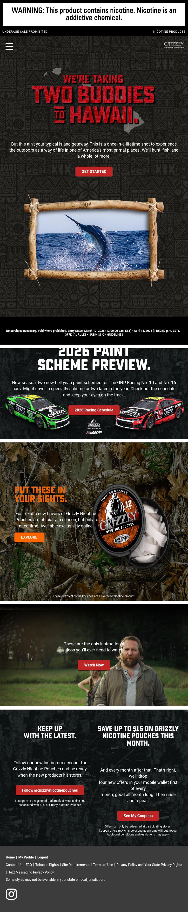
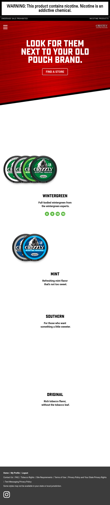
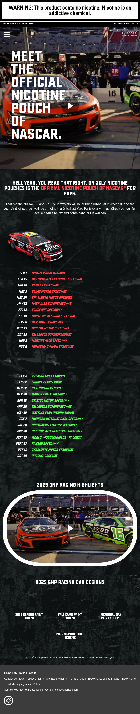
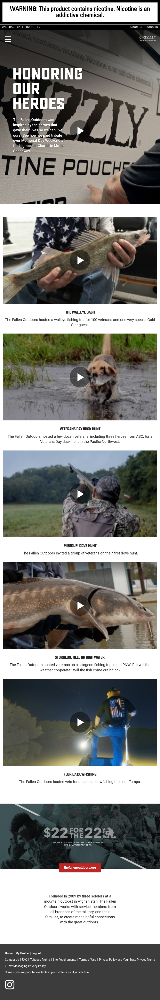
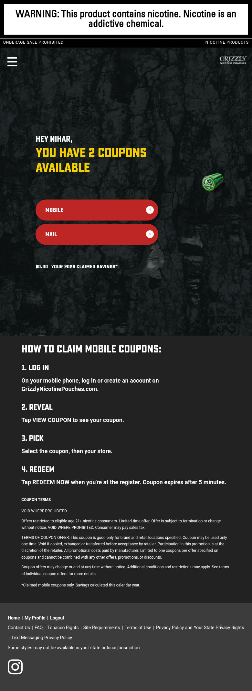
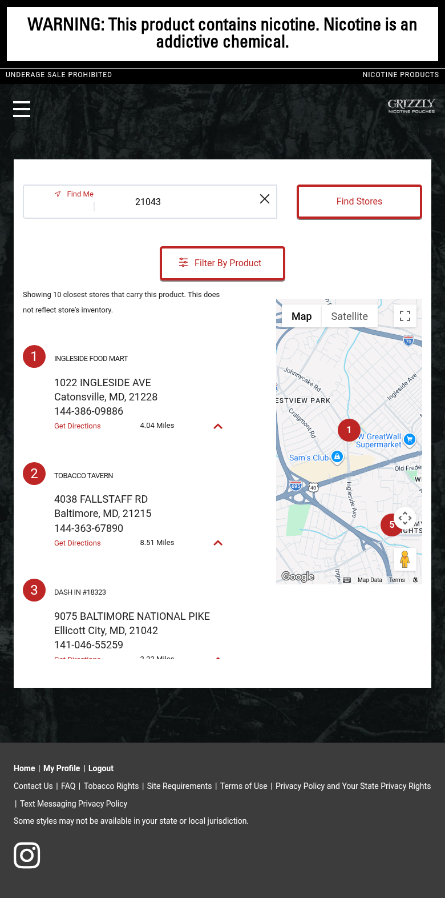
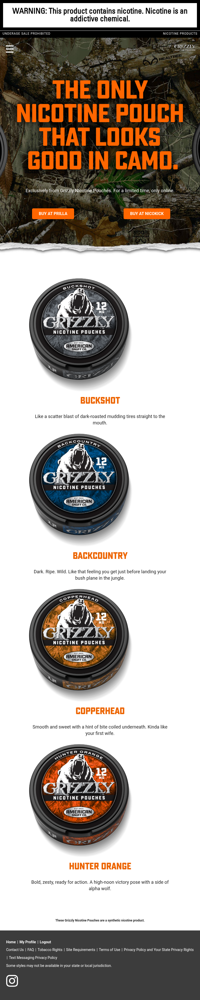
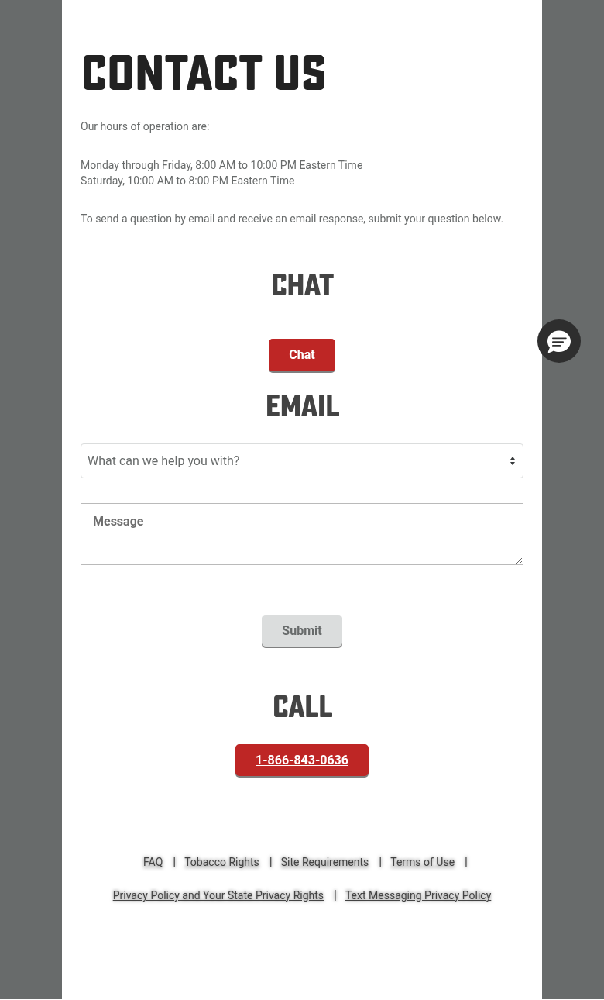
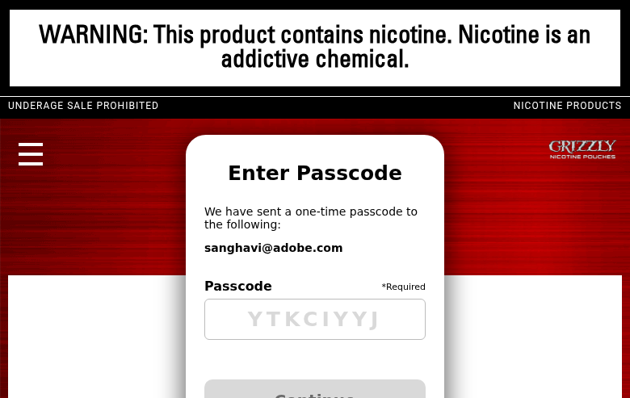

# Grizzly Nicotine Pouches — Comprehensive Site Analysis

## Executive Summary

**Site URL:** https://www.grizzlynicotinepouches.com/
**Brand:** Grizzly Nicotine Pouches (brand key: `grizzlymo`)
**Parent Company:** American Snuff Company, LLC (subsidiary of Reynolds American Inc. / BAT)
**Product Category:** Nicotine Pouches (tobacco-leaf-free)
**Site Classification:** Age-Gated Consumer Brand Website with Coupons & Loyalty
**Analysis Date:** March 31, 2026

Grizzly Nicotine Pouches is a relatively focused brand website within the RAI portfolio. Unlike the more complex tobacco brand sites (Camel, Vuse Vapor, Lucky Strike), this site centers on a newer product category — tobacco-leaf-free nicotine pouches — and positions itself with a rugged, outdoors-and-motorsports identity. The site features NASCAR sponsorship content (GNP Racing), veteran-focused outdoor content (The Fallen Outdoors), limited-edition product pages, and a standard coupon/store locator infrastructure shared across RAI brands.

The site is notably simpler than other RAI properties, with approximately 20–25 total pages. Its core templates are reused from the RAI shared AEM platform but carry a distinct dark, gritty visual identity with heavy use of Brightcove video and camo/outdoor imagery.

---

## 1. Templates Inventory

| # | Template Name | Complexity | Reasoning | Reference URL(s) |
|---|--------------|------------|-----------|-------------------|
| 1 | **Login / Registration** | Medium | Age-gate with VIA/SSO authentication, Brightcove video background, registration form with age verification | https://www.grizzlynicotinepouches.com/ |
| 2 | **Homepage** | High | Multi-section rich content: hero sweepstakes promo, racing CTA, limited-edition product promo, instructional video CTA, Instagram social feed, coupons CTA, Brightcove video backgrounds | https://www.grizzlynicotinepouches.com/secure.html |
| 3 | **Products Listing (Pouches)** | Medium | Hero with CTA, product flavor carousel with animated can images (4 strengths per flavor), auto-playing video backgrounds, coupon banner | https://www.grizzlynicotinepouches.com/secure/pouches.html |
| 4 | **Racing / Sponsorship** | High | Hero video player, race schedule tables (two cars — No. 10 and No. 16), car image gallery with paint schemes, highlight video, NASCAR trademark handling | https://www.grizzlynicotinepouches.com/secure/racing.html |
| 5 | **Content Hub (The Fallen Outdoors)** | High | Hero video, video card grid (5+ episodes), Brightcove players throughout, partner info section, external link to thefallenoutdoors.org | https://www.grizzlynicotinepouches.com/secure/the-fallen-outdoors.html |
| 6 | **Coupons** | Medium | Personalized greeting ("Hey NIHAR"), mail/mobile coupon tabs with badge counts, savings tracker, 4-step redemption instructions, terms & conditions | https://www.grizzlynicotinepouches.com/secure/coupons.html |
| 7 | **Store Locator** | Medium | Google Maps integration, geolocation ("Find Me"), zip code search, product filter, store listing with addresses and distances | https://www.grizzlynicotinepouches.com/secure/store-locator.html |
| 8 | **Limited Edition Product** | Medium | Full-bleed hero image, "BUY AT PRILLA" / "BUY AT NICOKICK" external purchase CTAs, product flavor cards (4 flavors), camo-themed design | https://www.grizzlynicotinepouches.com/secure/camo-set.html |
| 9 | **Contact Us** | Medium | Three-channel layout (Chat, Email form, Call), Salesforce Live Chat integration, topic dropdown (7 categories), phone number CTA | https://www.grizzlynicotinepouches.com/secure/footer-links/contact-us.html |
| 10 | **FAQ** | Medium | Categorized accordion layout (6 sections: Nicotine Pouches, Offers, Age Verification, Privacy, Troubleshooting, General), 25+ questions, anchor navigation | https://www.grizzlynicotinepouches.com/secure/footer-links/faq.html |
| 11 | **My Profile** | High | MFA-protected (email passcode), profile management behind second auth layer, consistent with RAI shared profile infrastructure | https://www.grizzlynicotinepouches.com/secure/my-profile.html |
| 12 | **Legal / Policy Pages** | Low | Static text-heavy pages with footer-only navigation, shared template across Terms of Use, Privacy Policy, Site Requirements, Text Messaging Privacy | https://www.grizzlynicotinepouches.com/secure/footer-links/terms-of-use.html |
| 13 | **Sweepstakes Official Rules** | Low | Long-form legal content, minimal styling, no header/footer (standalone), link references | https://www.grizzlynicotinepouches.com/promotions/hawaii-recruitment/official-rules.html |
| 14 | **Submission Guidelines** | Low | Static content page with bulleted guidelines, minimal styling | https://www.grizzlynicotinepouches.com/secure/submission-guidelines.html |

---

## 2. Blocks / Components Catalog

### 2.1 Navigation & Chrome

| # | Component | Complexity | Description | Reference URL(s) |
|---|-----------|------------|-------------|-------------------|
| 1 | **Nicotine Warning Banner** | Low | Fixed top banner: "WARNING: This product contains nicotine. Nicotine is an addictive chemical." White text on red background. Persistent across all pages. | All pages |
| 2 | **Regulatory Header Bar** | Low | "NICOTINE PRODUCTS" / "UNDERAGE SALE PROHIBITED" — dark bar below warning banner | All pages |
| 3 | **Main Header / Navbar** | Medium | Logo (GRIZZLYMO), hamburger menu, horizontal nav links (Pouches, GNP Racing, The Fallen Outdoors, Coupons with badge count, Store Locator, My Profile) | All authenticated pages |
| 4 | **Footer** | Low | Three-row footer: Home/My Profile/Logout, legal links (Contact Us, FAQ, Tobacco Rights, Site Requirements, Terms, Privacy, Text Messaging), Instagram social icon, state availability disclaimer | All authenticated pages |
| 5 | **Footer (Legal Pages)** | Low | Simplified footer with only legal links — no Home/My Profile/Logout row | Legal/policy pages |

### 2.2 Hero & Promotional Blocks

| # | Component | Complexity | Description | Reference URL(s) |
|---|-----------|------------|-------------|-------------------|
| 6 | **Sweepstakes Hero** | High | Full-width hero with animated headline ("WE'RE TAKING TWO BUDDIES TO HAWAII"), background imagery, CTA button ("GET STARTED"), legal disclaimer with Official Rules/Submission Guidelines links | Homepage |
| 7 | **Racing Hero (Video)** | High | Full-width hero with Brightcove video player, large display typography ("MEET THE OFFICIAL NICOTINE POUCH OF NASCAR"), overlay text | Racing page |
| 8 | **Content Hub Hero (Video)** | High | Full-width hero with Brightcove video, narrative overlay text ("HONORING OUR HEROES"), play button | The Fallen Outdoors |
| 9 | **Product Hero** | Medium | Red gradient background hero with bold headline ("LOOK FOR THEM NEXT TO YOUR OLD POUCH BRAND"), CTA button ("FIND A STORE") | Pouches page |
| 10 | **Limited Edition Hero** | Medium | Full-bleed camo background hero with display text ("THE ONLY NICOTINE POUCH THAT LOOKS GOOD IN CAMO"), dual CTA buttons for external retailers | Camo Set page |
| 11 | **Racing Promo Card** | Medium | Dark background section with racing car images, headline text, CTA button ("2026 Racing Schedule"), Grizzly/NASCAR logos | Homepage |

### 2.3 Content & Card Blocks

| # | Component | Complexity | Description | Reference URL(s) |
|---|-----------|------------|-------------|-------------------|
| 12 | **Product Flavor Card** | Medium | Animated can images (multiple angles), flavor name heading, description text, nicotine strength indicators (dots). Four variations: Wintergreen, Mint, Southern, Original | Pouches page |
| 13 | **Limited Edition Flavor Card** | Medium | Single product can image, flavor name heading, creative description text. Four flavors: Buckshot, Backcountry, Copperhead, Hunter Orange | Camo Set page |
| 14 | **Video Episode Card** | Medium | Brightcove video thumbnail with play button, episode title heading, description paragraph. Used in grid layout | The Fallen Outdoors |
| 15 | **Dual CTA Cards** | Medium | Two side-by-side cards: Instagram follow CTA (left) with Instagram screenshot, Coupons CTA (right) with product image. Each with heading, description, button | Homepage |
| 16 | **Camo Product Promo Section** | Medium | Split layout: left side with headline, description, CTA link; right side with product can images. Dark background with outdoor themed borders | Homepage |
| 17 | **Instructional Video Card** | Medium | Background image with overlay, descriptive text ("These are the only instructional videos you'll ever need to watch"), "Watch Now" CTA button | Homepage |
| 18 | **Race Car Design Card** | Low | Car image with paint scheme name heading. Used in horizontal carousel/grid | Racing page |
| 19 | **Partner Info Block** | Low | "$22 for the 22" campaign logo, organization description, external link button (thefallenoutdoors.org) | The Fallen Outdoors |

### 2.4 Interactive & Functional Blocks

| # | Component | Complexity | Description | Reference URL(s) |
|---|-----------|------------|-------------|-------------------|
| 20 | **Race Schedule Table** | Medium | Two-column table (date/venue), dark background with white text, one table per car (No. 10 and No. 16), car hero image above each table | Racing page |
| 21 | **Store Locator Widget** | High | Google Maps embed, geolocation button, zip code input, "Filter By Product" dropdown, numbered store results with addresses/phone/distance/directions links | Store Locator |
| 22 | **Coupon Dashboard** | High | Personalized header ("Hey NIHAR"), coupon count, MOBILE/MAIL tab toggle with badge counts, savings tracker ($0.00 / 2026 CLAIMED SAVINGS), dynamic coupon API integration | Coupons page |
| 23 | **4-Step Redemption Guide** | Low | Numbered steps (LOG IN, REVEAL, PICK, REDEEM) with heading and description for each step | Coupons page |
| 24 | **Contact Form (Email)** | Medium | Topic dropdown (7 categories: General, Product, Website, Promotion, Technical, Coupons, Others), message textarea, submit button | Contact Us |
| 25 | **Salesforce Chat Button** | Medium | Floating chat widget ("Hello, have a question? Let's chat."), Salesforce Live Chat integration (Prechat API) | Contact Us |
| 26 | **FAQ Accordion** | Medium | Expandable question/answer sections organized by category with anchor navigation, 25+ questions across 6 categories | FAQ page |
| 27 | **MFA Passcode Overlay** | High | Modal overlay for multi-factor authentication, email-based passcode input, "Continue" button. Blocks profile access until verified | My Profile |
| 28 | **Coupon Badge (Nav)** | Low | Red badge with coupon count number displayed on "Coupons" nav link | All pages (navigation) |

### 2.5 Media Blocks

| # | Component | Complexity | Description | Reference URL(s) |
|---|-----------|------------|-------------|-------------------|
| 29 | **Brightcove Video Player** | Medium | Embedded Brightcove player (Account: 5141850720001), used for hero videos, episode content, background video. Multiple instances per page on some templates | Racing, Fallen Outdoors, Homepage |
| 30 | **Background Video Loop** | Medium | Auto-playing looped video behind content sections, used on Homepage and Pouches page, no player controls visible | Homepage, Pouches |
| 31 | **Product Image Animation** | Medium | Multiple product can images that animate/rotate to show different angles and strengths | Pouches page |

### 2.6 Authentication & Legal

| # | Component | Complexity | Description | Reference URL(s) |
|---|-----------|------------|-------------|-------------------|
| 32 | **Age Gate / Login Form** | High | VIA (Verified Identity Authentication) with SSO across RAI brands, email/password fields, "Remember Me" option, registration link | Login page |
| 33 | **Coupon Terms Disclosure** | Low | Expandable legal terms section with void/restriction language | Coupons page |
| 34 | **Sweepstakes Legal Disclaimer** | Low | Inline text with links to Official Rules and Submission Guidelines, entry dates and restrictions | Homepage |
| 35 | **State Availability Notice** | Low | "Some styles may not be available in your state or local jurisdiction." — appears in footer on all pages | All pages |

---

## 3. Page Counts by Template

| Template | Est. Pages | Auto-Migrate? | Notes |
|----------|-----------|---------------|-------|
| Login / Registration | 1 | Manual | Age-gate auth, VIA SSO integration |
| Homepage | 1 | Manual | Dynamic content, sweepstakes promo, personalization |
| Products Listing (Pouches) | 1 | Semi-Auto | Animated product displays, video backgrounds |
| Racing / Sponsorship | 1 | Manual | Race schedule data, video gallery, image gallery |
| Content Hub (The Fallen Outdoors) | 1 | Manual | Multiple Brightcove video embeds, partner content |
| Coupons | 1 | Manual | Personalized coupon API, real-time badge counts |
| Store Locator | 1 | Manual | Google Maps API, geolocation, product filter |
| Limited Edition Product | 1 | Semi-Auto | External retailer links, product cards |
| Contact Us | 1 | Manual | Salesforce Chat, email form, phone CTA |
| FAQ | 1 | Semi-Auto | Accordion structure, anchor navigation |
| My Profile | 1 | Manual | MFA-protected, profile management |
| Legal / Policy Pages | 5 | Auto | Terms of Use, Privacy Policy, Site Requirements, Text Messaging Privacy, Submission Guidelines |
| Sweepstakes Official Rules | 1 | Auto | Long-form static legal content |
| **TOTAL** | **~17–20** | | |

### Migration Method Breakdown

| Method | Page Count | Percentage |
|--------|-----------|------------|
| Automatic Migration | 6 | ~33% |
| Semi-Automatic | 3 | ~17% |
| Manual Migration | 9 | ~50% |

---

## 4. Integrations Analysis

### 4.1 Adobe Experience Cloud

| # | Integration | Type | Complexity | Details | Reference |
|---|------------|------|------------|---------|-----------|
| 1 | **Adobe Experience Platform Launch** | Tag Management | High | Script: `launch-EN66d1505d231e4d7a8fc8c95533aae9b5.min.js`, Build: 2026-03-30, 25+ extensions loaded | All pages |
| 2 | **Adobe Analytics (AppMeasurement)** | Analytics | Medium | Version: 2.22.4, Report Suite: `raiservices.global.prod`, Server: `raiservices.sc.omtrdc.net`, Org: `02D9C50759DEA0920A495ED3@AdobeOrg` | All pages |
| 3 | **Adobe Target** | Personalization | Medium | Version: 2.11.4, View-level triggers (e.g., "grizzly nicotine pouches login and registration page", "secure", "secure:pouches") | All pages |
| 4 | **Adobe Audience Manager** | DMP | Medium | Module loaded via Launch (AppMeasurement_Module_AudienceManagement), aamlh=7 | All pages |
| 5 | **Adobe Client Data Layer** | Data Layer | Low | Version: 2.0.2, 62 events on homepage load | All pages |
| 6 | **Adobe Helix RUM** | Performance | Low | `rum.hlx.page/.rum/@adobe/helix-rum-js@^2/dist/rum-standalone.js` — Real User Monitoring for Edge Delivery Services readiness assessment | All pages |

### 4.2 Third-Party Integrations

| # | Integration | Type | Complexity | Details | Reference |
|---|------------|------|------------|---------|-----------|
| 7 | **Brightcove Video** | Video Platform | Medium | Account: `5141850720001`, multiple player instances, used for hero videos, content episodes, background loops | Homepage, Racing, Fallen Outdoors, Pouches |
| 8 | **Google Maps** | Maps API | Medium | Store locator integration with geolocation, zip code search, store listings with directions | Store Locator |
| 9 | **Facebook Pixel** | Advertising | Low | Pixel ID: `481080119534257`, event tracking for ad optimization | All pages |
| 10 | **Salesforce Live Chat** | Customer Support | Medium | Prechat API, floating chat widget on Contact Us page, "Hello, have a question?" prompt | Contact Us |
| 11 | **Instagram** | Social Media | Low | Link to @grizzlynicotinepouches, Instagram screenshot embedded on homepage | Homepage, Footer |

### 4.3 Custom / Proprietary Integrations

| # | Integration | Type | Complexity | Details | Reference |
|---|------------|------|------------|---------|-----------|
| 12 | **VIA / SSO Authentication** | Auth | High | Shared RAI age verification and single sign-on system, cross-brand authentication (viasso=true parameter) | Login, all secure pages |
| 13 | **Brand Site API** | API | High | Endpoint: `api.grizzlynicotinepouches.com`, powers coupon data, user profile, dynamic content | Coupons, Profile |
| 14 | **Coupon Platform** | API | High | Personalized offers (mail + mobile), real-time badge counts, savings tracker, time-limited redemption (5 min expiry) | Coupons |
| 15 | **MFA / Passcode Service** | Auth | Medium | Email-based one-time passcode for profile access, separate from initial login authentication | My Profile |
| 16 | **Service Worker / Resource Cache** | Custom Code | Medium | `resource-cache-service-worker.js` with brand-specific cache config (`grizzlymo-cache-config.json`), session UUID tracking | All pages |
| 17 | **External Retailer Links** | Embed | Low | Links to Prilla and NicoKick for online pouch purchases (limited edition only) | Camo Set |

### 4.4 External Redirects

| # | Integration | Type | Details | Reference |
|---|------------|------|---------|-----------|
| 18 | **Own It Voice It** | External Site | Tobacco Rights link redirects to `ownitvoiceit.com` (RAI advocacy site) | Footer link |

---

## 5. Complex Use Cases & Observations

### 5.1 NASCAR Official Sponsorship Content

| Attribute | Detail |
|-----------|--------|
| **Description** | GNP Racing is the "Official Nicotine Pouch of NASCAR" for 2026 with two cars (No. 10 and No. 16). The racing page features dual race schedules, paint scheme galleries, and highlight videos. |
| **Instances** | 1 dedicated page + homepage promo section |
| **Where Found** | `/secure/racing.html`, Homepage racing CTA |
| **Why Complex** | Two separate race schedule tables with 13-14 races each, branded car image gallery, trademark compliance (NASCAR registered trademark notice), video highlight content. Requires structured data for race dates and venues. |

### 5.2 The Fallen Outdoors Veteran Content Hub

| Attribute | Detail |
|-----------|--------|
| **Description** | Partnership with The Fallen Outdoors organization, featuring video episodes of veteran outdoor experiences (fishing, hunting, bowfishing). Five+ Brightcove video episodes with dedicated thumbnail cards. |
| **Instances** | 1 dedicated page |
| **Where Found** | `/secure/the-fallen-outdoors.html` |
| **Why Complex** | Multiple Brightcove video instances (25+ "Ignoring already initialized player" warnings in console), partner branding integration ("$22 for the 22" campaign), external link to thefallenoutdoors.org. Hero video + grid of episode video cards. |

### 5.3 Hawaii Sweepstakes Contest with Video Entry

| Attribute | Detail |
|-----------|--------|
| **Description** | "Outside Voices Hawaii Trip 2026" contest requiring video submission (60-second max), 8 survey questions, and interview round. Grand prize: hunting/fishing trip to Kailua-Kona, Hawaii (ARV $31,100 per winner). |
| **Instances** | Homepage hero + Official Rules page + Submission Guidelines page |
| **Where Found** | Homepage, `/promotions/hawaii-recruitment/official-rules.html`, `/secure/submission-guidelines.html` |
| **Why Complex** | Three-round judging process (video → questions → interview), video upload capability, age 35+ eligibility requirement, hunting license verification, background check requirement, binding arbitration clause. Active March 17 – April 14, 2026. |

### 5.4 Personalized Coupon System

| Attribute | Detail |
|-----------|--------|
| **Description** | Dynamic coupon dashboard with personalized greeting, real-time coupon counts (MOBILE and MAIL tabs with badge numbers), annual savings tracker, and 5-minute redemption window. |
| **Instances** | 1 dedicated page + navigation badge |
| **Where Found** | `/secure/coupons.html`, navigation bar (badge count) |
| **Why Complex** | Real-time API integration for coupon availability, personalized display ("Hey NIHAR"), mobile wallet integration, time-limited redemption mechanism, mail vs. mobile coupon distinction, savings calculation across calendar year. |

### 5.5 Limited-Edition Product with External E-Commerce

| Attribute | Detail |
|-----------|--------|
| **Description** | "Camo Set" limited-edition flavors (Buckshot, Backcountry, Copperhead, Hunter Orange) available exclusively online through third-party retailers Prilla and NicoKick. |
| **Instances** | 1 dedicated page + homepage promo section |
| **Where Found** | `/secure/camo-set.html`, Homepage |
| **Why Complex** | External retailer integration (not direct e-commerce), "synthetic nicotine product" distinction requiring separate regulatory handling, limited-time availability, camo-themed visual treatment distinct from core brand styling. |

### 5.6 Brightcove Video Initialization Issues

| Attribute | Detail |
|-----------|--------|
| **Description** | Console logs show 25+ "VIDEOJS: Ignoring already initialized player" warnings on The Fallen Outdoors page, and multiple instances on other video-heavy pages. |
| **Instances** | 3+ pages affected |
| **Where Found** | The Fallen Outdoors, Homepage, Racing page |
| **Why Complex** | Indicates potential performance issue with Brightcove player initialization — multiple player instances being re-initialized on the same page. May cause slow load times and increased memory consumption. Should be addressed in migration. |

### 5.7 Service Worker with Brand-Specific Caching

| Attribute | Detail |
|-----------|--------|
| **Description** | Custom service worker (`resource-cache-service-worker.js`) with brand-specific cache configuration (`grizzlymo-cache-config.json`), session UUID tracking, and container endpoint integration. |
| **Instances** | Site-wide |
| **Where Found** | All pages (registered at page load) |
| **Why Complex** | Custom caching strategy tied to brand API (`api.grizzlynicotinepouches.com`), session management via UUID, version-controlled cache configuration. Not a standard AEM pattern — would need re-implementation or replacement in EDS. |

### 5.8 Cross-Brand SSO via VIA

| Attribute | Detail |
|-----------|--------|
| **Description** | Site uses `viasso=true` parameter for cross-brand single sign-on. Authentication on one RAI brand site carries over to Grizzly Nicotine Pouches. |
| **Instances** | Login flow |
| **Where Found** | Login page redirect to `/secure.html?viasso=true` |
| **Why Complex** | Shared authentication infrastructure across RAI portfolio (americanspirit.com, camel.com, camelsnus.com, vusevapor.com, luckystrike.com, cougardips.com, etc.). MFA required for profile access as second authentication layer. |

---

## 6. Migration Estimates

### 6.1 Effort Breakdown

| Work Stream | Effort (Person-Days) | Notes |
|-------------|---------------------|-------|
| **Project Setup & Design System** | 8–12 | EDS project scaffolding, design tokens extraction (dark theme, camo patterns, Grizzly typography), global styles, responsive framework |
| **Header / Footer / Navigation** | 5–7 | Warning banner, regulatory bar, main nav with coupon badge, footer variants (authenticated vs. legal) |
| **Homepage** | 10–14 | Sweepstakes hero, racing promo, camo product section, video CTA, dual cards, multiple background video sections |
| **Products / Pouches Page** | 6–8 | Animated product can display, flavor cards, auto-playing background videos, coupon banner |
| **Racing / Sponsorship Page** | 8–10 | Race schedule tables (×2 cars), car image gallery, video hero, Brightcove player, highlight reel |
| **The Fallen Outdoors Hub** | 8–10 | Video episode grid (5+ episodes), hero video, partner info section, multiple Brightcove instances |
| **Coupons Page** | 8–12 | Coupon API integration, personalized dashboard, MOBILE/MAIL tabs, savings tracker, redemption flow |
| **Store Locator** | 6–8 | Google Maps integration, geolocation, zip search, store listing, product filter |
| **Limited Edition Product (Camo Set)** | 4–6 | Product cards, external retailer CTAs, camo-themed styling variant |
| **Contact Us** | 5–7 | Salesforce Chat integration, email form, topic dropdown, phone CTA |
| **FAQ** | 3–4 | Accordion component with 6 categories, anchor navigation, 25+ Q&A pairs |
| **Legal / Policy Pages (×5)** | 3–4 | Static content migration, shared legal template |
| **Sweepstakes / Official Rules** | 2–3 | Static legal content migration |
| **My Profile / MFA** | 6–8 | MFA passcode overlay, profile management, session handling |
| **Authentication / Age Gate** | 8–10 | VIA/SSO integration, cross-brand authentication, session management |
| **QA & Testing** | 12–18 | Cross-browser testing, mobile responsiveness, accessibility audit, Brightcove video testing, coupon flow E2E |
| **Performance Optimization** | 3–5 | PageSpeed 100 target, Brightcove lazy loading, image optimization, service worker replacement |
| **TOTAL** | **97–146** | |

### 6.2 Timeline Estimate

| Scenario | Team Size | Duration |
|----------|-----------|----------|
| Aggressive | 2 developers | 10–15 weeks |
| Standard | 2 developers | 12–18 weeks |
| Conservative | 1 developer | 20–30 weeks |

### 6.3 Complexity Distribution

| Complexity | Components | Percentage |
|------------|-----------|------------|
| Low | 10 | ~29% |
| Medium | 17 | ~49% |
| High | 8 | ~23% |

### 6.4 Risk Factors

| Risk | Impact | Likelihood | Mitigation |
|------|--------|------------|------------|
| Coupon API integration complexity | High | Medium | Early API documentation and testing; mock API for development |
| Brightcove video performance | Medium | High | Lazy loading, intersection observer pattern, limit concurrent players |
| Cross-brand SSO compatibility | High | Medium | Coordinate with RAI shared auth team; test across all brand sites |
| NASCAR trademark compliance | Low | Low | Legal review of branding guidelines before migration |
| Sweepstakes/contest time-sensitivity | Medium | Medium | Ensure contest landing pages are templated for future campaigns |
| Service worker migration | Medium | Medium | Evaluate EDS service worker patterns vs. custom caching needs |

### 6.5 Comparison with Other RAI Sites

| Site | Est. Pages | Templates | Components | Person-Days | Relative Complexity |
|------|-----------|-----------|------------|-------------|-------------------|
| americanspirit.com | ~35–45 | 15 | 38 | 120–175 | Medium-High |
| camel.com | ~50–60 | 17 | 42 | 135–195 | High |
| camelsnus.com | ~20–25 | 12 | 30 | 75–110 | Medium |
| vusevapor.com | ~60–80 | 20 | 55 | 180–260 | Very High |
| cougardips.com | ~25–30 | 13 | 33 | 90–130 | Medium |
| luckystrike.com | ~40–50 | 18 | 43 | 148–215 | High |
| **grizzlynicotinepouches.com** | **~17–20** | **14** | **35** | **97–146** | **Medium** |

---

## Screenshots

### Homepage


### Pouches (Products)


### GNP Racing


### The Fallen Outdoors


### Coupons


### Store Locator


### Camo Set (Limited Edition)


### Contact Us


### My Profile (MFA)


---

## Appendix A: Technical Stack Summary

| Component | Technology | Version/Detail |
|-----------|-----------|----------------|
| CMS | Adobe Experience Manager as a Cloud Service | AEM Sites |
| Tag Management | Adobe Experience Platform Launch | Build 2026-03-30 |
| Analytics | Adobe Analytics (AppMeasurement) | v2.22.4 |
| Personalization | Adobe Target (AT.js) | v2.11.4 |
| DMP | Adobe Audience Manager | Via Launch |
| Data Layer | Adobe Client Data Layer | v2.0.2 |
| Video | Brightcove | Account 5141850720001 |
| Maps | Google Maps JavaScript API | Via Store Locator |
| Chat | Salesforce Live Chat | Prechat API |
| Social | Facebook Pixel | ID 481080119534257 |
| Social | Instagram | @grizzlynicotinepouches |
| Auth | VIA/SSO (RAI Shared) | Cross-brand SSO |
| Brand API | Custom REST API | api.grizzlynicotinepouches.com |
| RUM | Adobe Helix RUM | rum.hlx.page |
| Caching | Custom Service Worker | grizzlymo-cache-config.json |

## Appendix B: Navigation Structure

```
[Login/Registration]
  └── [Homepage] /secure.html
        ├── Pouches /secure/pouches.html
        ├── GNP Racing /secure/racing.html
        ├── The Fallen Outdoors /secure/the-fallen-outdoors.html
        ├── Coupons /secure/coupons.html (badge: count)
        ├── Store Locator /secure/store-locator.html
        ├── My Profile /secure/my-profile.html (MFA)
        ├── [Camo Set] /secure/camo-set.html (linked from homepage)
        ├── [Hawaii Sweepstakes] /promotions/hawaii-recruitment/official-rules.html
        ├── [Submission Guidelines] /secure/submission-guidelines.html
        └── Footer Links:
              ├── Contact Us /secure/footer-links/contact-us.html
              ├── FAQ /secure/footer-links/faq.html
              ├── Tobacco Rights → ownitvoiceit.com (external)
              ├── Site Requirements /secure/footer-links/site-requirements.html
              ├── Terms of Use /secure/footer-links/terms-of-use.html
              ├── Privacy Policy /secure/footer-links/privacy-policy.html
              └── Text Messaging Privacy /secure/footer-links/textmessaging.html
```
