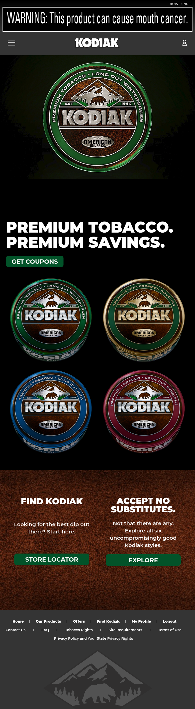
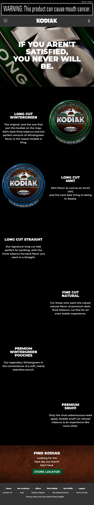
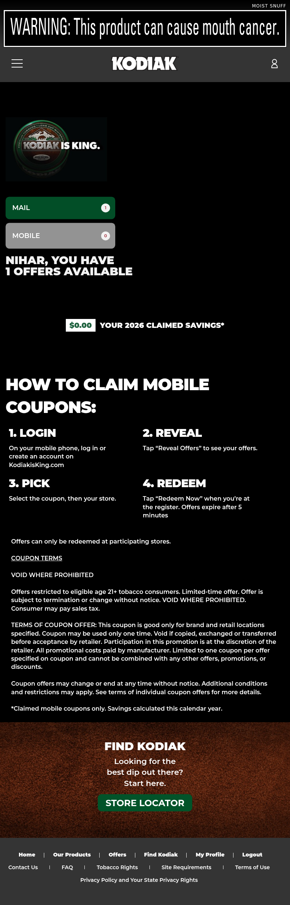
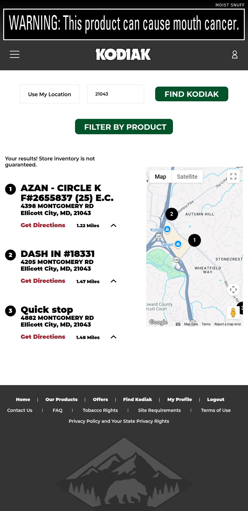
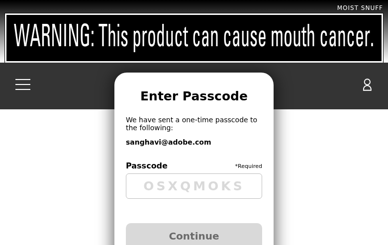
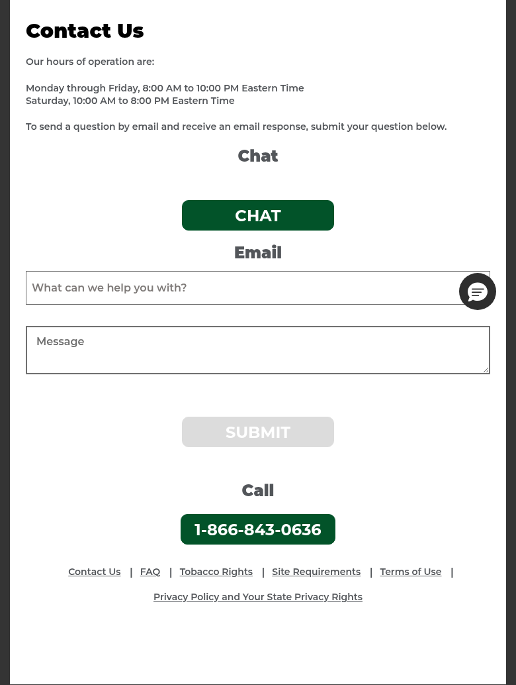
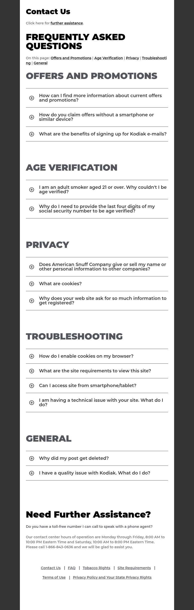

# KodiakIsKing.com — Comprehensive Site Analysis

## Executive Summary

KodiakIsKing.com is an age-gated consumer brand website for **Kodiak** moist snuff and pouches, operated by **American Snuff Company, LLC** (a subsidiary of Reynolds American Inc. / BAT). The site requires 21+ age verification via RAI's shared VIA/SSO authentication system and serves as the primary digital engagement platform for adult tobacco consumers of Kodiak products.

The site is built on **Adobe Experience Manager (AEM) as a Cloud Service** with a component-based architecture. It is notably one of the **simplest and most focused** RAI brand sites analyzed, with a streamlined product-centric design. Key integrations include Adobe Marketing Cloud (Analytics, Target, Audience Manager, Launch), Facebook Pixel, Google Maps, and a proprietary brand API at `api.kodiakisking.com`. The site has a dark, premium aesthetic with heavy use of product imagery (tin cans) and bold typography.

**Product Classification**: MOIST SNUFF (carries "WARNING: This product can cause mouth cancer." — not Surgeon General's Warning)

**Brand Tagline**: "Kodiak is King" / "Accept No Substitutes"

**Migration Complexity**: Low-Medium — estimated **55–85 person-days** for full Edge Delivery Services migration. This is among the simplest RAI brand sites due to its focused scope and lack of complex interactive features (no sweepstakes, no community content, no timeline).

---

# 1. Templates Inventory

## 1.1 Age Gate / Login Template

- **URL**: `https://www.kodiakisking.com/` (redirects to `/secure.html` when authenticated)
- **Purpose**: Pre-authentication landing with 21+ age verification
- **Complexity**: Medium
- **Key Features**:
  - RAI VIA/SSO shared authentication (`viasso=true` cross-brand login)
  - Age verification via SSN last-4 + identity matching
  - Multiple MFA recursion attempts observed in console logs
  - Redirects to homepage upon successful authentication
- **Components**: Age gate form, brand logo, legal disclaimers

## 1.2 Homepage Template (Post-Auth)

- **URL**: `https://www.kodiakisking.com/secure.html`
- **Purpose**: Primary authenticated landing page with hero video, product showcase, and CTAs
- **Complexity**: Medium
- **Key Features**:
  - Health warning banner at top: "MOIST SNUFF" + "WARNING: This product can cause mouth cancer."
  - Hero section with video background and Kodiak Wintergreen tin image
  - "PREMIUM TOBACCO. PREMIUM SAVINGS." coupon CTA section
  - Product tin image grid (4 products showcased)
  - Two-column CTA cards: "Find Kodiak" (Store Locator) + "Accept No Substitutes" (Products)
  - Profile icon in header for quick My Profile access
  - Instagram social link in hamburger menu
- **Components**: Health warning banner, Hero with video, Coupon CTA section, Product image grid, Two-column CTA cards, Footer with mountain logo



## 1.3 Products Listing Template

- **URL**: `https://www.kodiakisking.com/secure/products.html`
- **Purpose**: Product catalog for all Kodiak moist snuff styles
- **Complexity**: Medium
- **Key Features**:
  - Hero banner with background image: "IF YOU AREN'T SATISFIED, YOU NEVER WILL BE."
  - 6 product cards in alternating left/right layout:
    1. Long Cut Wintergreen — "The original, and the one that put this Kodiak on the map"
    2. Long Cut Mint — "Mint flavor as cool as an arctic chill"
    3. Long Cut Straight — "Our signature long cut leaf"
    4. Fine Cut Natural — "Robust natural flavor of premium dark-fired tobacco"
    5. Premium Wintergreen Pouches — "Legendary Wintergreen in convenience of a soft pouch"
    6. Premium Snuff — "Only the most adventurous need apply"
  - Each card: product tin image + heading + description
  - "Find Kodiak" Store Locator CTA at bottom
- **Components**: Hero banner, Product detail cards (alternating layout), Store Locator CTA



## 1.4 Offers / Coupons Template

- **URL**: `https://www.kodiakisking.com/secure/offers.html`
- **Purpose**: Personalized digital coupon redemption
- **Complexity**: High
- **Key Features**:
  - Personalized greeting: "NIHAR, YOU HAVE 1 Offers Available"
  - Two offer channels with tab-like buttons: MAIL (1) / MOBILE (0)
  - Year-to-date claimed savings tracker: "$0.00 YOUR 2026 CLAIMED SAVINGS*"
  - 4-step redemption guide: Login → Reveal → Pick → Redeem
  - 5-minute expiration timer on mobile coupons
  - Coupon terms and legal disclaimers
  - "Find Kodiak" Store Locator CTA at bottom
- **Components**: Personalization header, Offer channel tabs (Mail/Mobile), Savings tracker, Step-by-step guide, Coupon cards, Legal text, Store Locator CTA



## 1.5 Find Kodiak / Store Locator Template

- **URL**: `https://www.kodiakisking.com/secure/find-kodiak.html`
- **Purpose**: Locate nearby retailers carrying Kodiak products
- **Complexity**: High
- **Key Features**:
  - Google Maps integration with interactive map (Map/Satellite toggle)
  - "Use My Location" geolocation button
  - Zip code search input with "Find Kodiak" CTA
  - "Filter by Product" button for product-specific search
  - Store results list with:
    - Numbered markers matching map pins
    - Store name, address, city, state, zip
    - "Get Directions" link
    - Distance in miles
    - Expand/collapse arrows for details
  - Disclaimer: "Store inventory is not guaranteed."
- **Components**: Google Maps embed, Search input (zip code), Geolocation button, Product filter, Store results list, Get Directions links



## 1.6 My Profile Template (MFA-Gated)

- **URL**: `https://www.kodiakisking.com/secure/my-profile.html`
- **Purpose**: User account management with multi-factor authentication
- **Complexity**: High
- **Key Features**:
  - MFA passcode verification (one-time code sent to email)
  - Profile editing: name, address, state dropdown (all 50 states + DC), email, password
  - Communication preferences (email/mail opt-in/out)
  - Logout functionality
  - Phone support: 1-866-843-0636
- **Components**: MFA modal (passcode input + Continue), Profile edit form, State dropdown, Communication preferences, Logout button



## 1.7 Contact Us Template

- **URL**: `https://www.kodiakisking.com/secure/footer-links/contact-us.html`
- **Purpose**: Customer support with multi-channel contact options
- **Complexity**: Medium
- **Key Features**:
  - Three contact channels: Chat, Email, Call
  - Chat button (Salesforce integration — currently disabled/greyed in some views)
  - Email form with topic dropdown (7 categories: General comments, Product Related, Website Issue, Promotion, Technical Help, Coupons, Others)
  - Message textarea
  - Phone: 1-866-843-0636 (Mon-Fri 8am-10pm ET, Sat 10am-8pm ET)
  - Simplified footer navigation (pipe-separated links)
- **Components**: Contact channel sections (Chat/Email/Call), Topic dropdown, Email form, Phone button



## 1.8 FAQ Template (Accordion)

- **URL**: `https://www.kodiakisking.com/secure/footer-links/faq.html`
- **Purpose**: Frequently asked questions with expandable accordion sections
- **Complexity**: Low
- **Key Features**:
  - 5 categories: Offers and Promotions (3 Q&As), Age Verification (2 Q&As), Privacy (3 Q&As), Troubleshooting (4 Q&As), General (2 Q&As)
  - Total: 14 Q&A items
  - Accordion expand/collapse with plus icon
  - In-page anchor navigation ("On this page" links)
  - "Need Further Assistance?" section with toll-free number
  - References American Snuff Company (parent company) in Privacy section
- **Components**: Category headings, Accordion items with expand icon, In-page navigation, Contact assistance section



## 1.9 Legal / Compliance Pages Template

These pages share a common text-heavy template with minimal interactive components:

- **Site Requirements** (`/secure/footer-links/site-requirements.html`) — Browser and device requirements
- **Terms of Use** (`/secure/footer-links/terms-of-use.html`) — Website usage terms
- **Privacy Policy** (`/secure/footer-links/privacy-policy.html`) — Privacy Policy and State Privacy Rights

### External Redirect Pages

- **Tobacco Rights** → `ownitvoiceit.com` (RAI Services Company advocacy site — "Your Voice Matters. Use It.")

---

# 2. Blocks / Components Catalog

## 2.1 Global Components (Present on All/Most Pages)

| # | Component | Description | Complexity | Reference URL |
|---|-----------|-------------|------------|---------------|
| 1 | **Health Warning Banner** | "MOIST SNUFF" label + "WARNING: This product can cause mouth cancer." — fixed at top of every page | Low | All pages |
| 2 | **Header / Navigation Bar** | Brand logo (Kodiak), hamburger menu, profile icon | Medium | All pages |
| 3 | **Hamburger Menu / Mobile Nav** | Slide-out nav: Our Products, Offers, Find Kodiak + Instagram social link | Low | All pages |
| 4 | **Footer** | Two-section: primary nav (Home, Our Products, Offers, Find Kodiak, My Profile, Logout) + secondary nav (Contact Us, FAQ, legal links) | Low | All authenticated pages |
| 5 | **Footer Mountain Logo** | Decorative mountain silhouette graphic at bottom of footer | Low | All authenticated pages |
| 6 | **Footer Legal Navigation** | Pipe-separated links (Contact Us, FAQ, Tobacco Rights, Site Requirements, Terms of Use, Privacy Policy) | Low | Footer pages |

## 2.2 Hero / Banner Components

| # | Component | Description | Complexity | Reference URL |
|---|-----------|-------------|------------|---------------|
| 7 | **Homepage Hero with Video** | Full-width hero with video background and Kodiak Wintergreen tin image overlay | High | `/secure.html` |
| 8 | **Products Hero Banner** | Full-width background image with bold text overlay: "IF YOU AREN'T SATISFIED, YOU NEVER WILL BE." | Medium | `/secure/products.html` |

## 2.3 Content & Card Components

| # | Component | Description | Complexity | Reference URL |
|---|-----------|-------------|------------|---------------|
| 9 | **Coupon CTA Section** | "PREMIUM TOBACCO. PREMIUM SAVINGS." with "Get Coupons" button | Low | `/secure.html` |
| 10 | **Product Image Grid** | 2x2 grid of product tin images (4 tins visible on homepage) | Low | `/secure.html` |
| 11 | **Two-Column CTA Cards** | Side-by-side CTA blocks: "Find Kodiak" + "Accept No Substitutes" with buttons | Medium | `/secure.html` |
| 12 | **Product Detail Card (Alternating)** | Product tin image + heading + description in alternating left/right layout | Medium | `/secure/products.html` |
| 13 | **Store Locator CTA** | "FIND KODIAK" heading + description + "Store Locator" button (green) | Low | Multiple pages |

## 2.4 Offers / Coupon Components

| # | Component | Description | Complexity | Reference URL |
|---|-----------|-------------|------------|---------------|
| 14 | **Personalization Header** | "NIHAR, YOU HAVE X Offers Available" with dynamic user name and count | Medium | `/secure/offers.html` |
| 15 | **Offer Channel Tabs** | MAIL / MOBILE tab buttons with offer counts (green badges) | Medium | `/secure/offers.html` |
| 16 | **Savings Tracker** | "$0.00 YOUR 2026 CLAIMED SAVINGS*" year-to-date display | Low | `/secure/offers.html` |
| 17 | **Coupon Redemption Steps** | 4-step numbered guide: Login → Reveal → Pick → Redeem | Medium | `/secure/offers.html` |
| 18 | **Coupon Terms Block** | Legal disclaimers, terms, and conditions text block | Low | `/secure/offers.html` |

## 2.5 Store Finder Components

| # | Component | Description | Complexity | Reference URL |
|---|-----------|-------------|------------|---------------|
| 19 | **Google Maps Embed** | Interactive map with numbered store markers, Map/Satellite toggle | High | `/secure/find-kodiak.html` |
| 20 | **Store Search Bar** | "Use My Location" button + zip code input + "Find Kodiak" CTA | Medium | `/secure/find-kodiak.html` |
| 21 | **Product Filter Button** | "FILTER BY PRODUCT" green button for product-specific search | Low | `/secure/find-kodiak.html` |
| 22 | **Store Results List** | Numbered store entries with name, address, "Get Directions" link, distance | Medium | `/secure/find-kodiak.html` |

## 2.6 Form & Input Components

| # | Component | Description | Complexity | Reference URL |
|---|-----------|-------------|------------|---------------|
| 23 | **MFA Passcode Modal** | "Enter Passcode" modal with one-time code input, email display, Continue button | High | `/secure/my-profile.html` |
| 24 | **Contact Email Form** | Topic dropdown (7 categories) + Message textarea + Submit button | Medium | `/secure/footer-links/contact-us.html` |
| 25 | **Profile Edit Form** | Name, address, state dropdown, email, password, communication preferences | High | `/secure/my-profile.html` |

## 2.7 FAQ / Accordion Components

| # | Component | Description | Complexity | Reference URL |
|---|-----------|-------------|------------|---------------|
| 26 | **FAQ Accordion** | Expandable Q&A items with plus/minus icons, grouped by category | Medium | `/secure/footer-links/faq.html` |
| 27 | **In-Page Anchor Navigation** | "On this page" jump links for FAQ categories | Low | `/secure/footer-links/faq.html` |
| 28 | **Need Assistance Section** | "Need Further Assistance?" heading with phone number and hours | Low | `/secure/footer-links/faq.html` |

## 2.8 Chat & Support Components

| # | Component | Description | Complexity | Reference URL |
|---|-----------|-------------|------------|---------------|
| 29 | **Chat Button** | Salesforce-style chat launcher (disabled state observed) | Medium | `/secure/footer-links/contact-us.html` |
| 30 | **Phone Call Button** | Green "1-866-843-0636" phone CTA button | Low | `/secure/footer-links/contact-us.html` |

**Total Components: 30**

---

# 3. Page Count by Template

| Template | Page Count | Migration Type | URLs |
|----------|-----------|----------------|------|
| Age Gate / Login | 1 | Manual (auth flow) | `/` (pre-auth) |
| Homepage (Post-Auth) | 1 | Manual (video, dynamic content) | `/secure.html` |
| Products Listing | 1 | Automatic | `/secure/products.html` |
| Offers / Coupons | 1 | Manual (API, personalization) | `/secure/offers.html` |
| Find Kodiak / Store Locator | 1 | Manual (Google Maps, API) | `/secure/find-kodiak.html` |
| My Profile (MFA) | 1 | Manual (MFA, profile API) | `/secure/my-profile.html` |
| Contact Us | 1 | Manual (chat, email form) | `/secure/footer-links/contact-us.html` |
| FAQ (Accordion) | 1 | Automatic | `/secure/footer-links/faq.html` |
| Site Requirements | 1 | Automatic | `/secure/footer-links/site-requirements.html` |
| Terms of Use | 1 | Automatic | `/secure/footer-links/terms-of-use.html` |
| Privacy Policy | 1 | Automatic | `/secure/footer-links/privacy-policy.html` |
| **External Redirect** | 1 | N/A (redirect only) | Tobacco Rights → ownitvoiceit.com |
| **TOTAL** | **~11 pages** | 4 Auto / 6 Manual / 1 N/A | |

**Summary**:
- **Automatically migratable**: 4 pages (Products, FAQ, Site Requirements, Terms of Use, Privacy Policy)
- **Requires manual migration**: 6 pages (Homepage, Offers, Store Locator, My Profile, Contact Us, Login/Age Gate)
- **External redirect (N/A)**: 1 page (Tobacco Rights)

This is the **smallest RAI brand site** analyzed, with only ~11 unique pages compared to 17–20+ pages on other RAI brands.

---

# 4. Integrations & Third-Party Services

## 4.1 Adobe Marketing Cloud

| Integration | Version/Details | Type | Complexity | Reference URL |
|-------------|----------------|------|------------|---------------|
| **Adobe Launch (DTM)** | `launch-EN66d1505d231e4d7a8fc8c95533aae9b5.min.js` | Embed | Low | All pages |
| **Adobe Analytics** | AppMeasurement v2.22.4 | Embed | Medium | All pages |
| **Adobe Target** | v2.11.4 | Embed | Medium | All pages |
| **Adobe Audience Manager** | v9.4 (via Analytics) | Embed | Low | All pages |
| **Adobe Client Data Layer** | v5.4.0 | Embed | Low | All pages |
| **Adobe Helix RUM** | `rum.hlx.page` | Embed | Low | All pages |

**Report Suite**: `raiservices.global.prod`
**Tracking Server**: `raiservices.sc.omtrdc.net`
**Organization ID**: `02D9C50759DEA0920A495ED3@AdobeOrg`
**Brand Key** (v1 prop): `kodiak`

*Note*: Same Adobe Launch script ID (`EN66d1505d231e4d7a8fc8c95533aae9b5`) shared across all RAI brand sites (Grizzly, Pall Mall, Camel, etc.).

## 4.2 Authentication & Identity

| Integration | Details | Type | Complexity | Reference URL |
|-------------|---------|------|------------|---------------|
| **RAI VIA/SSO** | `viasso=true` cross-brand auth | Custom Code | High | All pages |
| **Multi-Factor Authentication** | Email-based OTP for profile access | Custom Code | High | `/secure/my-profile.html` |
| **Identity Verification** | SSN last-4 + name + address matching | API | High | Login flow |

## 4.3 Third-Party Services

| Integration | Details | Type | Complexity | Reference URL |
|-------------|---------|------|------------|---------------|
| **Facebook Pixel** | Pixel ID: `481080119534257` | Embed | Low | All pages |
| **Google Maps** | Maps JavaScript API | Embed | Medium | `/secure/find-kodiak.html` |
| **MyFonts** | `hello.myfonts.net/count/3e6f48` (licensed web fonts) | Embed | Low | All pages |
| **Service Worker** | `resource-cache-service-worker.js` | Custom Code | Medium | All pages |
| **Brand API** | `api.kodiakisking.com` | API | High | Offers, Profile, Store Locator |
| **Instagram** | `instagram.com/kodiaksmokeless` | Link | Low | Hamburger menu |

## 4.4 Compliance & Legal

| Integration | Details | Type | Complexity | Reference URL |
|-------------|---------|------|------------|---------------|
| **Moist Snuff Warning** | "WARNING: This product can cause mouth cancer." | Embed | Low | All pages |
| **MOIST SNUFF Label** | Product category label at top of every page | Embed | Low | All pages |

## 4.5 External Brand Properties

| Property | URL | Relationship |
|----------|-----|-------------|
| **Own It Voice It** | `ownitvoiceit.com` | RAI Services Company tobacco rights advocacy (Tobacco Rights redirect) |
| **Instagram** | `instagram.com/kodiaksmokeless` | Official Kodiak social media |

---

# 5. Complex Use Cases & Observations

## 5.1 Video Hero Background (Medium Complexity)

The homepage features a **video background** in the hero section:

- Full-width video element with autoplay behavior
- Kodiak Wintergreen tin overlaid on video
- Responsive video scaling across devices
- Video likely served from Brightcove or CDN

**Instances**: 1 (Homepage only)
**Found**: `/secure.html`
**Why Complex**: Video hero requires careful handling of autoplay policies, responsive video sizing, and performance optimization. Video background is not a standard EDS pattern and requires custom block development.

**Estimated Effort**: 3–5 person-days

## 5.2 Personalized Coupon System (High Complexity)

The offers page demonstrates personalization:

- **Dynamic greeting** using authenticated user's first name ("NIHAR, YOU HAVE")
- **Dual-channel offer tabs**: MAIL vs MOBILE with counts
- **Year-to-date savings tracker**: "$0.00 YOUR 2026 CLAIMED SAVINGS*"
- **5-minute expiration timer** on mobile coupons
- **4-step redemption flow** with visual guide
- **Backend coupon management** via `api.kodiakisking.com`

**Instances**: 1 page, multiple dynamic components
**Found**: `/secure/offers.html`
**Why Complex**: Tightly coupled to brand API for coupon retrieval, personalization, savings tracking, and redemption. Timer components require real-time behavior.

**Estimated Effort**: 10–14 person-days

## 5.3 Store Locator with Google Maps (High Complexity)

The Find Kodiak page integrates a full Google Maps experience:

- Interactive map with store markers
- Geolocation (browser GPS permission)
- Zip code search with "Find Kodiak" CTA
- **Product filtering** — unique "Filter by Product" button not seen on all RAI sites
- Store results with addresses, distances, and "Get Directions" links
- Numbered markers matching between list and map

**Instances**: 1 page
**Found**: `/secure/find-kodiak.html`
**Why Complex**: Google Maps JavaScript API integration, geolocation permissions, store data API, product filtering logic, and responsive map/list layout.

**Estimated Effort**: 5–8 person-days

## 5.4 MFA / Profile Management (High Complexity)

My Profile requires multi-factor authentication:

- Email-based one-time passcode (OTP)
- Console logs show "MFA recursing for page parent" — MFA component recursively checks container
- Profile editing: name, address, state (50 states + DC dropdown), email, password
- Communication preferences management
- Logout flow

**Instances**: 1 page
**Found**: `/secure/my-profile.html`
**Why Complex**: MFA flow requires server-side OTP generation and validation via brand API. The recursive MFA component behavior adds frontend complexity.

**Estimated Effort**: 5–8 person-days

## 5.5 Cross-Brand VIA/SSO Authentication (High Complexity)

Authentication uses RAI's shared VIA/SSO system:

- `viasso=true` parameter enables cross-brand SSO
- Shared authentication across Kodiak, Grizzly, Pall Mall, Camel, and other RAI brands
- Age verification (21+) with identity matching
- Session management with `secureAuto.js` script
- Service Worker for API caching with `resource-cache-service-worker.js`

**Instances**: Global (affects all pages)
**Found**: All authenticated pages
**Why Complex**: Authentication is a cross-brand dependency managed by RAI's identity platform. Any migration must integrate with the existing VIA/SSO infrastructure.

**Estimated Effort**: 8–12 person-days

## 5.6 Facebook Pixel Tracking (Low Complexity)

Unlike some other RAI brand sites, Kodiak **includes Facebook Pixel**:

- Pixel ID: `481080119534257`
- Full fbevents.js integration with extensive event parameter list
- Tracks page views, conversions, and user interactions

**Instances**: All pages
**Found**: Global
**Why Complex**: Simple embed, but requires proper event mapping during migration to ensure marketing attribution continuity.

**Estimated Effort**: 1–2 person-days

## 5.7 Minimal Site Scope — Key Observation

Kodiak is the **most focused RAI brand site** analyzed:

- **No sweepstakes/promotions** (unlike Pall Mall, Camel)
- **No community content wall** (unlike Pall Mall)
- **No interactive timeline** (unlike Pall Mall)
- **No SMS signup page** (unlike Pall Mall, Grizzly)
- **No Federal Court corrective statements** (this is moist snuff, not cigarettes)
- **No Brightcove video player** (video is embedded differently)
- **Only 6 products** with straightforward catalog
- **Single social link** (Instagram only)

This simplicity makes Kodiak an excellent **pilot candidate** for RAI brand site EDS migration.

---

# 6. Migration Estimates

## 6.1 Summary Estimate

| Category | Low Estimate | High Estimate |
|----------|-------------|---------------|
| **Design System & Global Styles** | 5 days | 8 days |
| **Header / Navigation / Footer** | 4 days | 6 days |
| **Health Warning Banner** | 1 day | 2 days |
| **Authentication (VIA/SSO)** | 8 days | 12 days |
| **Homepage (with Video Hero)** | 5 days | 8 days |
| **Products Page** | 3 days | 4 days |
| **Offers / Coupons** | 10 days | 14 days |
| **Find Kodiak (Store Locator)** | 5 days | 8 days |
| **My Profile (MFA)** | 5 days | 8 days |
| **Contact Us (Chat + Email)** | 3 days | 5 days |
| **FAQ Page** | 2 days | 3 days |
| **Legal / Compliance Pages (3 pages)** | 2 days | 3 days |
| **Facebook Pixel + Analytics** | 1 day | 2 days |
| **Service Worker / Caching** | 2 days | 3 days |
| **Integration Testing & QA** | 6 days | 10 days |
| **TOTAL** | **55 days** | **85 days** |

## 6.2 Effort Breakdown by Skill

| Skill Area | Percentage | Days (Avg) |
|------------|-----------|------------|
| Frontend Development (HTML/CSS/JS) | 35% | 19–30 days |
| API Integration & Backend Services | 25% | 14–21 days |
| Authentication & Security | 15% | 8–13 days |
| Content Migration | 10% | 6–9 days |
| Design / UX Adaptation | 8% | 4–7 days |
| Testing & QA | 7% | 4–6 days |

## 6.3 Critical Path Items

1. **VIA/SSO Authentication Integration** — Blocks all authenticated page development
2. **Brand API (`api.kodiakisking.com`) Integration** — Required for coupons, profile, store locator
3. **Google Maps Integration** — Required for Find Kodiak page
4. **Video Hero Implementation** — Custom block for homepage video background
5. **Health Warning Banner** — Must be present on all pages (legal compliance)

## 6.4 Risk Factors

| Risk | Impact | Mitigation |
|------|--------|------------|
| Brand API availability/documentation | High | Early API discovery and documentation phase |
| VIA/SSO integration complexity | High | Engage RAI identity team early; reuse patterns from other RAI migrations |
| Video hero performance | Medium | Use EDS-optimized video loading patterns |
| MyFonts licensing | Low | Verify font license covers EDS domains |
| Facebook Pixel event mapping | Low | Document all current events before migration |

## 6.5 Recommended Migration Phases

### Phase 1: Foundation (Weeks 1–2)
- Design system extraction and CSS custom properties (dark theme, green accents)
- Global components (health warning, header, footer, navigation)
- Authentication integration (VIA/SSO)
- Legal/compliance pages (static content)

### Phase 2: Core Pages (Weeks 3–5)
- Homepage with video hero and product grid
- Products catalog with alternating card layout
- FAQ with accordion components
- Contact Us with email form and chat

### Phase 3: Complex Features (Weeks 6–8)
- Offers/Coupons with personalization and dual-channel tabs
- Find Kodiak store locator with Google Maps
- My Profile with MFA

### Phase 4: Polish & QA (Weeks 9–10)
- Integration testing across all pages
- Performance optimization (target: Lighthouse 100)
- Accessibility audit (WCAG 2.1 AA)
- Facebook Pixel event verification
- Cross-browser and mobile testing

## 6.6 Pilot Migration Recommendation

Given Kodiak's **minimal scope** (11 pages, 30 components, no sweepstakes, no UGC), it is the strongest candidate among analyzed RAI brand sites for a **pilot EDS migration**:

| Factor | Kodiak | Pall Mall | Grizzly |
|--------|--------|-----------|---------|
| Page Count | ~11 | ~17-19 | ~17-20 |
| Components | 30 | 38 | 35 |
| Estimated Days | 55-85 | 85-130 | 97-146 |
| Sweepstakes | No | Yes | No |
| Community Content | No | Yes | No |
| Federal Court Notice | No | Yes | No |
| Complexity | Low-Medium | Medium-High | Medium-High |

---

# Appendix A: Technical Architecture Details

## A.1 AEM Configuration

```
AEM Template: freeform
Client Libraries:
  - reynoldsamerican-aem-base/clientlibs/clientlib-dependencies
  - kodiak/clientlibs/clientlib-dependencies
  - kodiak/clientlibs/clientlib-all
  - kodiak/clientlibs/clientlib-site

Git Build:
  - Branch: 05fb5805407d527c8b8f0de84cbfd3709d111022
  - Build Time: 2026-03-19T18:56:25+0000

Fonts: MyFonts (hello.myfonts.net/count/3e6f48)
```

## A.2 Analytics Configuration

```
Adobe Analytics Configuration:
- Library: AppMeasurement v2.22.4
- Report Suite: raiservices.global.prod
- Tracking Server: raiservices.sc.omtrdc.net
- Organization: 02D9C50759DEA0920A495ED3@AdobeOrg
- Client Data Layer: v5.4.0
- Brand Key (v1): kodiak
- Page naming: "secure:page-name" pattern
- Authentication state (v23): "authenticated"

Adobe Target Configuration:
- Library: at.js v2.11.4
- View tracking: Page load views with path-based naming

Facebook Pixel:
- Pixel ID: 481080119534257
- Library: fbevents.js v2.9.288
- Domain: www.kodiakisking.com
```

## A.3 Brand API Endpoints (Inferred)

```
Base URL: api.kodiakisking.com
Site Key: kodiak

Likely endpoints:
- /auth/* — Authentication, MFA verification
- /coupons/* — Coupon retrieval, redemption, savings tracking
- /profile/* — User profile CRUD, preferences
- /stores/* — Store finder search, geolocation, product filtering
```

## A.4 Cross-Brand Comparison (RAI Sites)

| Feature | Kodiak | Grizzly | Pall Mall |
|---------|--------|---------|-----------|
| Product Type | Moist Snuff | Nicotine Pouches | Cigarettes |
| Health Warning | Mouth Cancer | Nicotine Addictive | Surgeon General's |
| Page Count | ~11 | ~17-20 | ~17-19 |
| Components | 30 | 35 | 38 |
| Facebook Pixel | Yes | Yes | No |
| Video Hero | Yes | No | No |
| Sweepstakes | No | No | Yes |
| Community Content | No | No | Yes |
| Instagram Link | Yes | No | No |
| SMS Signup | No | No | Yes |
| Federal Court Notice | No | No | Yes |
| Launch Script | EN66d1505d... | EN66d1505d... | EN66d1505d... |
| Migration Est. | 55-85 days | 97-146 days | 85-130 days |

## A.5 Screenshots Reference

| Screenshot | Page | File |
|------------|------|------|
| kodiak-01 | Homepage | `kodiak-01-homepage.png` |
| kodiak-02 | Products | `kodiak-02-products.png` |
| kodiak-03 | Offers | `kodiak-03-offers.png` |
| kodiak-04 | Find Kodiak | `kodiak-04-find-kodiak.png` |
| kodiak-05 | My Profile (MFA) | `kodiak-05-myprofile-mfa.png` |
| kodiak-06 | Contact Us | `kodiak-06-contact-us.png` |
| kodiak-07 | FAQ | `kodiak-07-faq.png` |
