# PallMallUSA.com — Comprehensive Site Analysis

## Executive Summary

PallMallUSA.com is an age-gated consumer brand website for **Pall Mall** cigarettes, operated by **R.J. Reynolds Tobacco Company** (a subsidiary of Reynolds American Inc. / BAT). The site requires 21+ age verification via RAI's shared VIA/SSO authentication system and serves as the primary digital engagement platform for adult smokers of Pall Mall cigarettes.

The site is built on **Adobe Experience Manager (AEM) as a Cloud Service** with a component-based architecture, integrating Adobe Marketing Cloud (Analytics, Target, Audience Manager, Launch), Brightcove video, Google Maps, Salesforce Live Chat, and a proprietary brand API at `api.pallmallusa.com`. Key differentiators from other RAI brand sites include a **community comment wall** with user-generated content, an **interactive history poll**, **Federal Court corrective statements**, and a **coffee-themed "Daybreak Giveaway" sweepstakes** with $55,000 in prizes.

**Product Classification**: CIGARETTES (not smokeless/nicotine pouches — carries Surgeon General's Warning)

**Migration Complexity**: Medium-High — estimated **85–130 person-days** for full Edge Delivery Services migration.

---

# 1. Templates Inventory

## 1.1 Age Gate / Login Template

- **URL**: `https://www.pallmallusa.com/` (redirects to `/secure.html` when authenticated)
- **Purpose**: Pre-authentication landing with 21+ age verification
- **Key Features**:
  - RAI VIA/SSO shared authentication (`viasso=true` cross-brand login)
  - Age verification via SSN last-4 + identity matching
  - Redirects to homepage upon successful authentication
- **Components**: Age gate form, brand logo, legal disclaimers

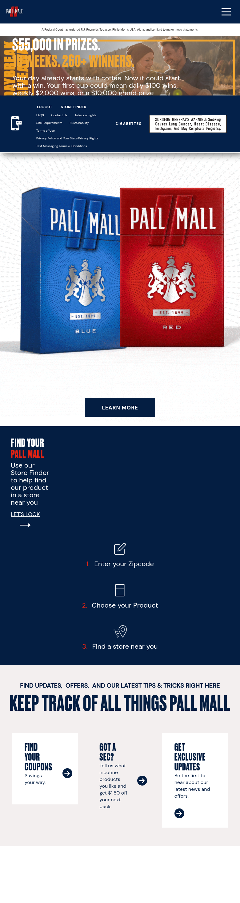

## 1.2 Homepage Template (Post-Auth)

- **URL**: `/secure.html`
- **Purpose**: Primary authenticated landing page with hero promotions, CTAs, and content cards
- **Key Features**:
  - Federal Court corrective statements notice banner (legally required)
  - Hero section: "Daybreak Giveaway" sweepstakes ($55K prizes, 260+ winners)
  - SMS signup CTA with phone icon
  - "Find Your Pall Mall" store finder promo (3-step visual guide)
  - Content card grid: Coupons, TPS Survey ($1.50 incentive), Exclusive Updates
  - Dynamic content via Adobe Target (personalization)
- **Components**: Federal Court banner, Hero carousel/banner, SMS CTA card, Store finder promo, Content card grid, Footer with Surgeon General's Warning


## 1.3 Products Listing Template

- **URL**: `/secure/products.html`
- **Purpose**: Product catalog for all Pall Mall cigarette styles
- **Key Features**:
  - 6 product cards: Red, Blue, Orange, Black (menthol), White (menthol), Green (menthol)
  - Each card: product image, flavor description, availability (Kings & 100's), Store Finder link
  - Fixed SMS signup CTA at bottom
  - Responsive grid layout
- **Components**: Product card grid, Product detail card (image, description, CTA), SMS signup CTA, Store finder link

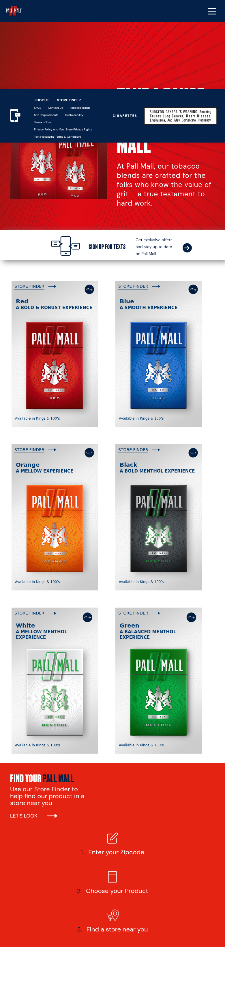

## 1.4 Coupons / Offers Template

- **URL**: `/secure/coupons.html`
- **Purpose**: Personalized digital coupon redemption
- **Key Features**:
  - Personalized greeting ("Hey, NIHAR")
  - "Mobile 3" badge indicator
  - 4-step redemption flow: LOGIN → View Offers → Shop Nearby → Redeem at Register
  - Coupon cards with 5-minute expiration timer
  - Integration with coupon management system via brand API
- **Components**: Personalization header, Badge indicator, Step-by-step guide, Coupon card carousel, Timer component

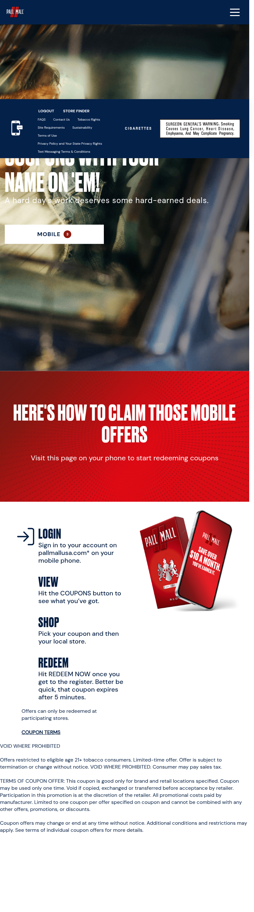

## 1.5 Sweepstakes / Promotion Template

- **URL**: `/secure/promotion/daybreak-giveaway.html`
- **Purpose**: Interactive sweepstakes entry and information
- **Key Features**:
  - "Daybreak Giveaway" — coffee mug themed ($55K total prizes)
  - Prize tiers: $100 daily instant wins, $2,000 weekly, $10,000 grand prize
  - March 6 – May 15, 2026 (10 weekly periods)
  - 260+ total winners
  - Enter Now CTA button
  - Links to Official Rules and FAQs
- **Components**: Sweepstakes hero banner, Prize tier display, Entry CTA, Legal disclaimers, Date range display

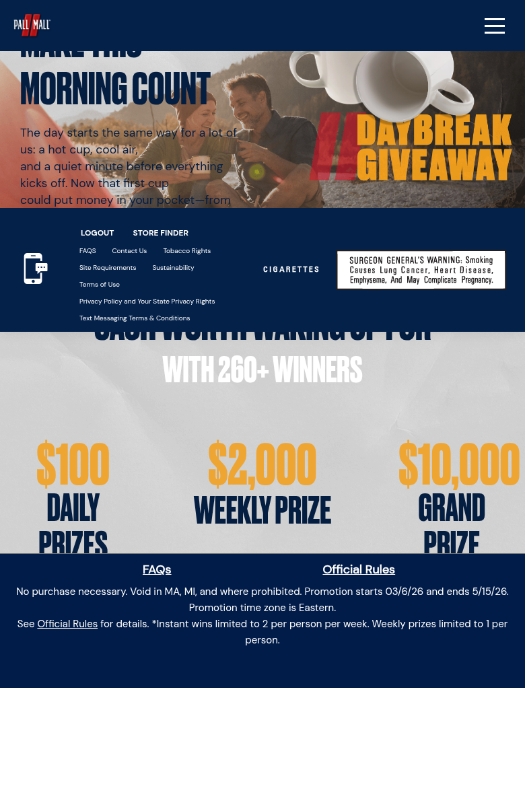

## 1.6 History / Timeline Template

- **URL**: `/secure/our-history.html`
- **Purpose**: Brand heritage storytelling with interactive community features
- **Key Features**:
  - Interactive timeline spanning 1899 to Today (6 eras)
  - Interactive poll: "Which part of our story stands out to you?" with radio button voting
  - **Community comment wall** — user-generated comments with:
    - User avatars, display names, timestamps
    - Like/heart functionality with counts
    - Reply threading
    - Character limit for comments
  - Coupon CTA section at bottom
- **Components**: Timeline component, Interactive poll with radio buttons, Comment wall with UGC, Like/reply interactions, Coupon CTA banner

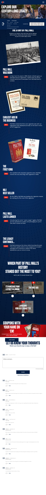

## 1.7 Store Finder Template

- **URL**: `/secure/store-finder.html`
- **Purpose**: Locate nearby retailers carrying Pall Mall products
- **Key Features**:
  - Google Maps integration with interactive map
  - Geolocation (browser GPS)
  - Zip code search input
  - Store results list with addresses and distances
  - Product availability filtering
- **Components**: Google Maps embed, Search input (zip code), Geolocation button, Store results list, Product filter

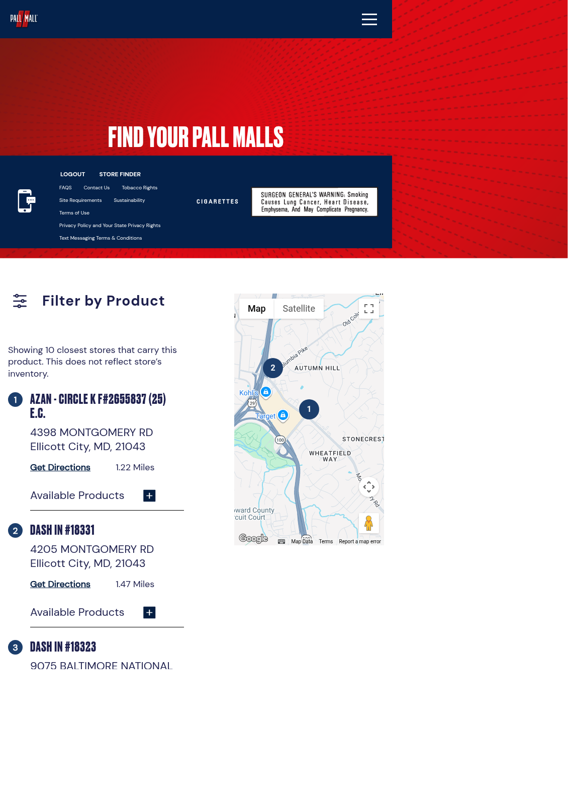

## 1.8 SMS Signup Template

- **URL**: `/secure/sms.html`
- **Purpose**: Text message opt-in for promotional communications
- **Key Features**:
  - Phone number input field
  - TCPA consent checkbox with legal language
  - Submit CTA
  - Privacy policy and text messaging terms links
- **Components**: Phone input form, TCPA consent checkbox, Submit button, Legal text

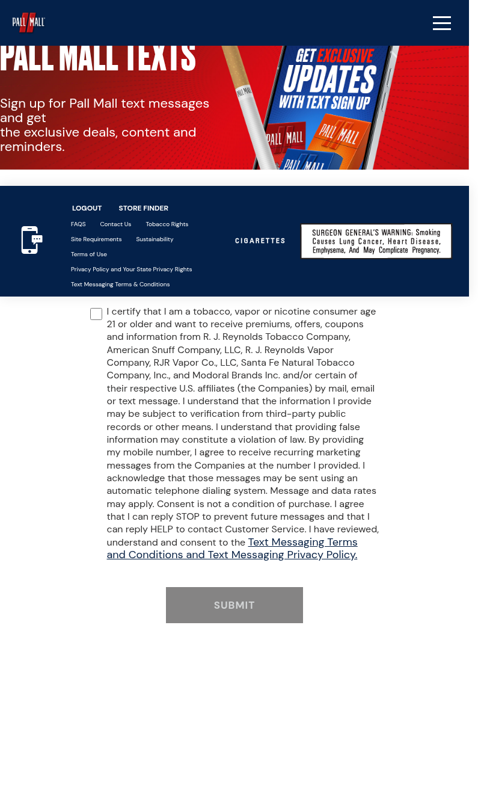

## 1.9 Contact Us Template

- **URL**: `/secure/footer-links/contact-us.html`
- **Purpose**: Customer support with multi-channel contact options
- **Key Features**:
  - Three contact channels: Chat, Email, Call
  - **Salesforce Live Chat** integration (Prechat API with topic selection)
  - Topic dropdown with 8 categories
  - Phone: 1-866-756-9287 (Mon-Fri 8am-10pm ET, Sat 10am-8pm ET)
  - Email form with subject/message fields
- **Components**: Contact channel cards (Chat/Email/Call), Salesforce chat widget, Topic dropdown, Contact form, Phone number with hours

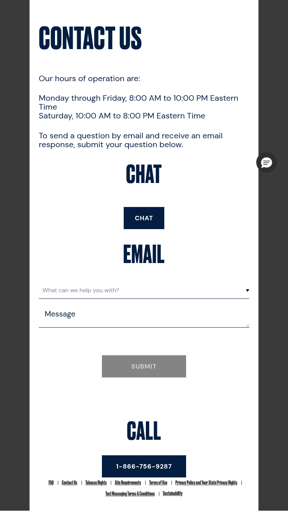

## 1.10 FAQ Template (Accordion)

- **URL**: `/secure/footer-links/faq.html`
- **Purpose**: Frequently asked questions with expandable accordion sections
- **Key Features**:
  - 6 categories: Offers & Promotions, Age Verification, Privacy, Troubleshooting, Product Quality, Environmental Stewardship
  - Accordion expand/collapse pattern per question
  - In-page anchor navigation ("On this page" links)
  - "Need Further Assistance?" section with phone number
  - Environmental stewardship content (Keep America Beautiful, TerraCycle partnerships)
- **Components**: Category headings, Accordion items, In-page navigation, Contact assistance section

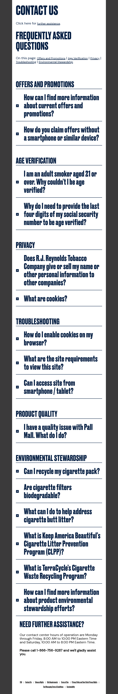

## 1.11 My Profile Template (MFA-Gated)

- **URL**: `/secure/my-profile.html`
- **Purpose**: User account management with multi-factor authentication
- **Key Features**:
  - MFA passcode verification (one-time code sent to email)
  - Profile editing: name, address, state, email, password
  - State dropdown (all 50 US states + DC)
  - Communication preferences (email/mail opt-in/out)
  - Logout functionality
- **Components**: MFA modal (passcode input + Continue), Profile edit form, State dropdown, Communication preferences, Logout button

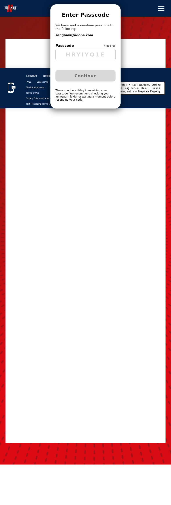

## 1.12 Sweepstakes FAQ Template

- **URL**: `/secure/promotion/daybreak-giveaway/faqs.html`
- **Purpose**: Detailed Q&A for the Daybreak Giveaway sweepstakes
- **Key Features**:
  - 14 Q&A pairs covering entry, eligibility, prizes, delivery, technical support
  - Links to Official Rules throughout
  - Prize support phone: 844-682-0554
  - Technical support phone: 1-888-566-5952
  - State exclusions: MA, MI, and U.S. Territories
- **Components**: Q&A list (non-accordion, long-form), Official Rules links, Support phone numbers

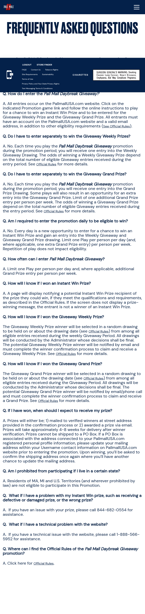

## 1.13 Official Rules Template (Public)

- **URL**: `/promotion/daybreak-giveaway/official-rules.html`
- **Purpose**: Legal sweepstakes rules (publicly accessible, no authentication required)
- **Key Features**:
  - Dense legal content with 11 numbered sections
  - Prize structure tables (10 weekly periods, 250 instant win prizes)
  - Detailed eligibility, arbitration, and liability terms
  - Sponsor: R.J. Reynolds Tobacco Company, 401 N. Main Street, Winston-Salem, NC 27101
  - Administrator: Arrowhead Promotion & Fulfillment Co., Inc.
  - Pre-auth footer navigation (different from authenticated footer)
- **Components**: Legal text blocks, Prize tables, Section navigation, Pre-auth footer

## 1.14 Legal / Compliance Pages Template

These pages share a common text-heavy template with minimal interactive components:

- **Site Requirements** (`/secure/footer-links/site-requirements.html`) — Browser and device requirements
- **Terms of Use** (`/secure/footer-links/terms-of-use.html`) — Website usage terms
- **Privacy Policy** (`/secure/footer-links/privacy-policy.html`) — Privacy Policy and State Privacy Rights
- **Text Messaging T&C** (`/secure/footer-links/textmessaging.html`) — SMS Terms and Conditions

### External Redirect Pages

Two footer links redirect to external sites:

- **Tobacco Rights** → `ownitvoiceit.com` (RAI Services Company advocacy site — "Your Voice Matters. Use It.")
- **Sustainability** → `reynoldsamerican.com/product-stewardship/` (Reynolds American corporate site — "Circular Economy" / environmental stewardship)

---

# 2. Blocks / Components Catalog

## 2.1 Global Components (Present on All/Most Pages)

| # | Component | Description | Complexity |
|---|-----------|-------------|------------|
| 1 | **Header / Navigation Bar** | Brand logo (Pall Mall), hamburger menu, responsive nav | Medium |
| 2 | **Hamburger Menu / Mobile Nav** | Slide-out nav: Coupons, Sweepstakes, Our History, Products (submenu), Store Finder, Profile | Medium |
| 3 | **Footer** | Two-column footer links, Logout, Store Finder, legal links | Low |
| 4 | **SMS Signup CTA (Footer)** | Phone icon with "social links" label, links to SMS page | Low |
| 5 | **Surgeon General's Warning** | "CIGARETTES" label + Surgeon General's Warning image (legally required) | Low |
| 6 | **Federal Court Corrective Statement Banner** | Legally mandated notice about court-ordered statements | Medium |
| 7 | **Footer Navigation** | Dual-column link lists (primary: Logout/Store Finder; secondary: legal links) | Low |

## 2.2 Hero / Banner Components

| # | Component | Description | Complexity |
|---|-----------|-------------|------------|
| 8 | **Sweepstakes Hero Banner** | "Daybreak Giveaway" — coffee mug imagery, prize amounts, Enter Now CTA | Medium |
| 9 | **Page Title Hero** | Large text hero with background (used on Products, History, etc.) | Low |
| 10 | **Sweepstakes FAQ Hero** | Dark navy hero with "Frequently Asked Questions" title | Low |

## 2.3 Content & Card Components

| # | Component | Description | Complexity |
|---|-----------|-------------|------------|
| 11 | **Content Card Grid** | 3-column card layout with image, heading, description, CTA button | Medium |
| 12 | **Product Card** | Product image, name, flavor description, availability, Store Finder link | Medium |
| 13 | **Product Grid** | 6-card responsive grid for product catalog | Low |
| 14 | **Coupon Card** | Personalized coupon with expiration timer, redemption steps | High |
| 15 | **Store Finder Promo** | "Find Your Pall Mall" 3-step visual guide with icons | Medium |
| 16 | **SMS Signup Card** | Image + "Sign Up for Texts" heading + CTA button | Low |
| 17 | **TPS Survey Card** | "Got a sec?" — tobacco product survey with $1.50 incentive | Low |

## 2.4 Interactive Components

| # | Component | Description | Complexity |
|---|-----------|-------------|------------|
| 18 | **Interactive Timeline** | 6-era brand history (1899-Today) with click/tap navigation | High |
| 19 | **Interactive Poll** | "Which part of our story stands out?" — radio button voting | Medium |
| 20 | **Community Comment Wall** | User-generated comments with avatars, likes, replies, timestamps | Very High |
| 21 | **Accordion / FAQ** | Expandable Q&A items with category grouping | Medium |
| 22 | **In-Page Anchor Navigation** | "On this page" jump links for FAQ categories | Low |
| 23 | **Coupon Redemption Steps** | 4-step visual flow: LOGIN → View → Shop → Redeem | Medium |

## 2.5 Form & Input Components

| # | Component | Description | Complexity |
|---|-----------|-------------|------------|
| 24 | **MFA Passcode Modal** | One-time passcode input with Continue button, email display | High |
| 25 | **Phone Number Input** | SMS signup form with TCPA consent | Medium |
| 26 | **Contact Form** | Topic dropdown (8 categories), subject, message, submit | Medium |
| 27 | **Store Finder Search** | Zip code input + geolocation button | Medium |
| 28 | **Profile Edit Form** | Name, address, state dropdown, email, password, preferences | High |
| 29 | **Sweepstakes Entry CTA** | "Enter Now" button with game mechanics | Medium |

## 2.6 Map & Location Components

| # | Component | Description | Complexity |
|---|-----------|-------------|------------|
| 30 | **Google Maps Embed** | Interactive map with store markers and zoom/pan | High |
| 31 | **Store Results List** | Address, distance, product availability per store | Medium |
| 32 | **Geolocation Button** | Browser GPS permission request for nearby stores | Low |

## 2.7 Chat & Support Components

| # | Component | Description | Complexity |
|---|-----------|-------------|------------|
| 33 | **Salesforce Live Chat** | Prechat form with topic dropdown, live agent connection | High |
| 34 | **Contact Channel Cards** | Chat / Email / Call channel selector | Low |

## 2.8 Legal & Compliance Components

| # | Component | Description | Complexity |
|---|-----------|-------------|------------|
| 35 | **Legal Text Block** | Dense legal content with numbered sections | Low |
| 36 | **Prize Structure Table** | Weekly period dates, prize amounts, winner counts | Medium |
| 37 | **Personalization Badge** | "Mobile 3" badge on coupons page (user segment indicator) | Low |
| 38 | **Personalized Greeting** | "Hey, [NAME]" dynamic greeting on coupons | Low |

**Total Components: 38**

---

# 3. Page Count by Template

| Template | Page Count | URLs |
|----------|-----------|------|
| Age Gate / Login | 1 | `/` (pre-auth) |
| Homepage (Post-Auth) | 1 | `/secure.html` |
| Products Listing | 1 | `/secure/products.html` |
| Coupons / Offers | 1 | `/secure/coupons.html` |
| Sweepstakes / Promotion | 1 | `/secure/promotion/daybreak-giveaway.html` |
| History / Timeline | 1 | `/secure/our-history.html` |
| Store Finder | 1 | `/secure/store-finder.html` |
| SMS Signup | 1 | `/secure/sms.html` |
| Contact Us | 1 | `/secure/footer-links/contact-us.html` |
| FAQ (Accordion) | 1 | `/secure/footer-links/faq.html` |
| My Profile (MFA) | 1 | `/secure/my-profile.html` |
| Sweepstakes FAQ | 1 | `/secure/promotion/daybreak-giveaway/faqs.html` |
| Official Rules (Public) | 1 | `/promotion/daybreak-giveaway/official-rules.html` |
| Site Requirements | 1 | `/secure/footer-links/site-requirements.html` |
| Terms of Use | 1 | `/secure/footer-links/terms-of-use.html` |
| Privacy Policy | 1 | `/secure/footer-links/privacy-policy.html` |
| Text Messaging T&C | 1 | `/secure/footer-links/textmessaging.html` |
| **External Redirects** | 2 | Tobacco Rights → ownitvoiceit.com; Sustainability → reynoldsamerican.com |
| **TOTAL** | **~17–19 pages** | (excluding external redirects) |

**Note**: The site may contain additional promotion-specific landing pages, seasonal content, or A/B test variations managed through Adobe Target that are not discoverable via standard navigation.

---

# 4. Integrations & Third-Party Services

## 4.1 Adobe Marketing Cloud

| Service | Version/Details | Purpose |
|---------|----------------|---------|
| **Adobe Launch (DTM)** | `launch-EN66d1505d231e4d7a8fc8c95533aae9b5.min.js` | Tag management (same script ID as Grizzly Nicotine Pouches) |
| **Adobe Analytics** | AppMeasurement v2.22.4 | Web analytics and reporting |
| **Adobe Target** | v2.11.4 | A/B testing, personalization, experience optimization |
| **Adobe Audience Manager** | Integrated via Analytics | Audience segmentation and DMP |
| **Adobe Client Data Layer** | v2.0.2 | Standardized data layer (74 events on homepage) |
| **Adobe Helix RUM** | `rum.hlx.page` | Real User Monitoring (Edge Delivery Services telemetry) |

**Report Suite**: `raiservices.global.prod`
**Tracking Server**: `raiservices.sc.omtrdc.net`
**Organization ID**: `02D9C50759DEA0920A495ED3@AdobeOrg`

## 4.2 Authentication & Identity

| Service | Details | Purpose |
|---------|---------|---------|
| **RAI VIA/SSO** | `viasso=true` cross-brand authentication | Shared 21+ age verification across all RAI brands |
| **Multi-Factor Authentication** | Email-based OTP for profile access | Additional security for account management |
| **Identity Verification** | SSN last-4 + name + address matching | Age verification compliance (21+ requirement) |

## 4.3 Third-Party Services

| Service | Details | Purpose |
|---------|---------|---------|
| **Brightcove Video** | Account ID: `5141850724001` | Video hosting and streaming (different account than Grizzly's `5141850720001`) |
| **Google Maps** | Maps JavaScript API | Store finder map functionality |
| **Salesforce Live Chat** | Prechat API integration | Customer support live chat on Contact Us page |
| **Service Worker** | `pallmall-cache-config.json` | Offline caching and PWA capabilities |
| **Brand API** | `api.pallmallusa.com` | Backend services (coupons, profile, sweepstakes, comments) |

## 4.4 Compliance & Legal

| Integration | Details | Purpose |
|-------------|---------|---------|
| **Federal Court Corrective Statements** | Court-ordered health disclosures | Legal compliance (R.J. Reynolds, Philip Morris USA, Altria, Lorillard) |
| **Surgeon General's Warning** | Image-based warning on all pages | FDA/TTB tobacco labeling requirement |
| **TCPA Consent** | Checkbox on SMS signup | Telephone Consumer Protection Act compliance |
| **Arrowhead Promotion & Fulfillment** | Sweepstakes administrator | Prize fulfillment and drawing administration |
| **Digital Choice Prepaid Mastercard** | The Bancorp Bank / Mastercard | Prize payment mechanism for instant win prizes |

## 4.5 External Brand Properties

| Property | URL | Relationship |
|----------|-----|-------------|
| **Own It Voice It** | `ownitvoiceit.com` | RAI Services Company tobacco rights advocacy (Tobacco Rights redirect) |
| **Reynolds American** | `reynoldsamerican.com/product-stewardship/` | Corporate sustainability / circular economy content (Sustainability redirect) |
| **Keep America Beautiful** | `kab.org` | Cigarette litter prevention partnership |
| **TerraCycle** | `terracycle.com` | Cigarette waste recycling program |

---

# 5. Complex Use Cases & Observations

## 5.1 Community Comment Wall (Very High Complexity)

The Our History page features a **user-generated content comment wall** that is unique among the RAI brand sites analyzed:

- **User avatars and display names** from authenticated profiles
- **Timestamps** on each comment
- **Like/heart functionality** with real-time counts
- **Reply threading** (nested conversations)
- **Character limits** for comment input
- **Content moderation** (likely via brand API backend)

**Migration Impact**: This requires a complete backend service for comment storage, moderation, and retrieval. The UGC component would need custom block development with API integration, potentially using an external commenting service or custom Edge Delivery Services API routes.

**Estimated Effort**: 15–20 person-days for full implementation including backend, moderation, and frontend components.

## 5.2 Interactive History Timeline (High Complexity)

The brand history timeline spans from 1899 to Today with 6 distinct eras:

- Interactive navigation between time periods
- Rich content per era (text, imagery)
- Smooth transitions between periods
- Mobile-responsive timeline visualization
- Integration with poll and comment wall below

**Migration Impact**: Requires custom block development with JavaScript animation/interaction logic. The timeline data structure needs careful content modeling.

**Estimated Effort**: 8–12 person-days

## 5.3 Personalized Coupon System (High Complexity)

The coupons page demonstrates sophisticated personalization:

- **Dynamic greeting** using authenticated user's first name
- **"Mobile 3" badge** indicating user segment/tier
- **5-minute expiration timer** on coupon cards
- **4-step redemption flow** with visual progress
- **Backend coupon management** via `api.pallmallusa.com`
- **Personalization** driven by Adobe Target segments

**Migration Impact**: Requires custom API integration, timer components, and Adobe Target personalization setup. The coupon system is tightly coupled to the brand API backend.

**Estimated Effort**: 12–15 person-days

## 5.4 Federal Court Corrective Statements (Medium Complexity)

A legally mandated banner appears on the homepage (and potentially other pages):

> "A Federal Court has ordered R.J. Reynolds Tobacco, Philip Morris USA, Altria, and Lorillard to make these statements."

This links to a `#health-effects` anchor with detailed health disclosures. This component is **legally required** and must be preserved exactly during migration.

**Migration Impact**: Simple component but requires legal review to ensure exact content preservation. Must be prominently displayed and not removable by content authors.

**Estimated Effort**: 2–3 person-days

## 5.5 Interactive Voting Poll (Medium Complexity)

The Our History page includes an interactive poll:

- Radio button selection from multiple options
- Submit/vote functionality
- Results display (likely percentage-based)
- Integration with brand API for vote storage

**Migration Impact**: Requires custom block with API integration for vote submission and results retrieval.

**Estimated Effort**: 5–7 person-days

## 5.6 Sweepstakes Game Mechanics (High Complexity)

The Daybreak Giveaway implements a multi-tier prize system:

- **Instant Win Game**: 250 prizes ($100 each) via randomly pre-selected winning times
- **Weekly Drawing**: 10 prizes ($2,000 each) via random selection
- **Grand Prize Drawing**: 1 prize ($10,000) from all entries
- **Daily play limit**: 1 per person per day
- **Weekly instant win limit**: 2 per person per week
- **Extra Grand Prize entries** via bonus activities (videos, trivia)
- **Email notification** for winners
- **Affidavit/W-9 process** for prizes over $2,000

**Migration Impact**: The game mechanics likely run server-side via the brand API. Frontend migration focuses on the entry UI, but backend sweepstakes logic would remain on `api.pallmallusa.com`.

**Estimated Effort**: 8–12 person-days (frontend only; backend service assumed to remain)

## 5.7 Salesforce Live Chat Integration (High Complexity)

The Contact Us page integrates Salesforce Live Chat:

- **Prechat form** with topic dropdown (8 categories)
- **Live agent routing** based on selected topic
- **Chat widget** with real-time messaging
- **Business hours** enforcement

**Migration Impact**: Requires Salesforce Chat SDK integration in Edge Delivery Services. Third-party script loading and initialization must be handled in the `delayed.js` phase.

**Estimated Effort**: 5–8 person-days

## 5.8 Service Worker / PWA Capabilities

The site implements a Service Worker with `pallmall-cache-config.json`:

- **Offline caching** for key assets
- **API request caching** for `api.pallmallusa.com` endpoints
- **Cache invalidation** strategies
- **PWA-like** behavior for mobile users

**Migration Impact**: Edge Delivery Services has its own caching strategy. The Service Worker would need to be reimplemented or replaced with EDS's built-in caching mechanisms.

**Estimated Effort**: 3–5 person-days

---

# 6. Migration Estimates

## 6.1 Summary Estimate

| Category | Low Estimate | High Estimate |
|----------|-------------|---------------|
| **Design System & Global Styles** | 8 days | 12 days |
| **Header / Navigation / Footer** | 5 days | 8 days |
| **Authentication (VIA/SSO)** | 8 days | 12 days |
| **Homepage** | 5 days | 8 days |
| **Products Page** | 3 days | 5 days |
| **Coupons / Offers** | 12 days | 15 days |
| **Sweepstakes / Promotion** | 8 days | 12 days |
| **Our History (Timeline + Poll + Comments)** | 18 days | 25 days |
| **Store Finder** | 5 days | 8 days |
| **SMS Signup** | 2 days | 3 days |
| **Contact Us (Salesforce Chat)** | 5 days | 8 days |
| **FAQ Page** | 3 days | 4 days |
| **My Profile (MFA)** | 5 days | 8 days |
| **Legal / Compliance Pages (5 pages)** | 3 days | 5 days |
| **Service Worker / Caching** | 3 days | 5 days |
| **Integration Testing & QA** | 8 days | 12 days |
| **TOTAL** | **85 days** | **130 days** |

## 6.2 Effort Breakdown by Skill

| Skill Area | Percentage | Days (Avg) |
|------------|-----------|------------|
| Frontend Development (HTML/CSS/JS) | 35% | 30–45 days |
| API Integration & Backend Services | 25% | 22–32 days |
| Authentication & Security | 10% | 8–12 days |
| Content Migration | 10% | 8–13 days |
| Design / UX Adaptation | 10% | 8–13 days |
| Testing & QA | 10% | 8–12 days |

## 6.3 Critical Path Items

1. **VIA/SSO Authentication Integration** — Blocks all authenticated page development
2. **Brand API (`api.pallmallusa.com`) Integration** — Required for coupons, comments, polls, sweepstakes, profile
3. **Community Comment Wall** — Most complex custom component; no EDS equivalent exists
4. **Sweepstakes Game Engine** — Server-side logic must be preserved or reimplemented
5. **Federal Court Corrective Statements** — Legal compliance; must be exactly preserved
6. **Salesforce Chat Integration** — Third-party dependency requiring careful initialization

## 6.4 Risk Factors

| Risk | Impact | Mitigation |
|------|--------|------------|
| Brand API availability/documentation | High | Early API discovery and documentation phase |
| VIA/SSO integration complexity | High | Engage RAI identity team early |
| UGC comment wall moderation | Medium | Evaluate third-party commenting services |
| Sweepstakes legal compliance | Medium | Legal review of all promotion-related content |
| Adobe Target personalization parity | Medium | Map all Target activities before migration |
| Service Worker compatibility | Low | Leverage EDS built-in caching |

## 6.5 Recommended Migration Phases

### Phase 1: Foundation (Weeks 1–3)
- Design system extraction and CSS custom properties
- Global components (header, footer, navigation)
- Authentication integration (VIA/SSO)
- Legal/compliance pages (static content)

### Phase 2: Core Pages (Weeks 4–7)
- Homepage with Federal Court notice
- Products catalog
- Store Finder with Google Maps
- FAQ and Contact Us (with Salesforce Chat)
- SMS Signup

### Phase 3: Complex Features (Weeks 8–12)
- Coupons/Offers with personalization and timer
- Sweepstakes entry and game mechanics
- Our History with timeline, poll, and comment wall
- My Profile with MFA

### Phase 4: Polish & QA (Weeks 13–15)
- Integration testing across all pages
- Performance optimization (target: Lighthouse 100)
- Accessibility audit (WCAG 2.1 AA)
- Cross-browser and mobile testing
- Legal review of all compliance content

---

# Appendix A: Technical Architecture Details

## A.1 AEM Component Paths (Observed)

The site uses standard AEM as a Cloud Service component architecture with:

- Core Components (Tabs container, Accordion, etc.)
- Custom RAI brand components
- Brightcove video components
- Salesforce Chat integration components

## A.2 Analytics Configuration

```
Adobe Analytics Configuration:
- Library: AppMeasurement v2.22.4
- Report Suite: raiservices.global.prod
- Tracking Server: raiservices.sc.omtrdc.net
- Organization: 02D9C50759DEA0920A495ED3@AdobeOrg
- Client Data Layer: v2.0.2 (74 events on homepage load)
- Page naming: "secure:page-name" pattern (e.g., "secure:my-profile")

Adobe Target Configuration:
- Library: at.js v2.11.4
- View tracking: Page load views with path-based naming
- Personalization: Active on homepage (dynamic content cards)
```

## A.3 Brand API Endpoints (Inferred)

```
Base URL: api.pallmallusa.com

Likely endpoints:
- /auth/* — Authentication, MFA verification
- /coupons/* — Coupon retrieval, redemption, expiry
- /profile/* — User profile CRUD, preferences
- /comments/* — Community wall CRUD, likes, replies
- /polls/* — Vote submission, results retrieval
- /sweepstakes/* — Game entry, winning verification
- /stores/* — Store finder search, geolocation
```

## A.4 Cross-Brand Comparison (RAI Sites)

| Feature | Pall Mall | Grizzly | Camel | Lucky Strike |
|---------|-----------|---------|-------|-------------|
| Product Type | Cigarettes | Nicotine Pouches | Cigarettes/Snus | Cigarettes |
| Health Warning | Surgeon General's | Nicotine Warning | Surgeon General's | Surgeon General's |
| Brightcove Account | 5141850724001 | 5141850720001 | Varies | Varies |
| Launch Script | EN66d1505d... | EN66d1505d... | EN66d1505d... | EN66d1505d... |
| Comment Wall | Yes | No | No | No |
| Interactive Poll | Yes | No | No | No |
| Federal Court Notice | Yes | No | Yes | Yes |
| Sweepstakes | Daybreak Giveaway | No | Varies | Varies |
| NASCAR Content | No | Yes (GNP Racing) | No | No |
| Veteran Content | No | Yes (Fallen Outdoors) | No | No |

## A.5 Screenshots Reference

| Screenshot | Page | File |
|------------|------|------|
| pallmall-01 | Homepage | `pallmall-01-homepage.png` |
| pallmall-02 | Products | `pallmall-02-products.png` |
| pallmall-03 | Coupons | `pallmall-03-coupons.png` |
| pallmall-04 | Sweepstakes | `pallmall-04-sweepstakes.png` |
| pallmall-05 | Our History | `pallmall-05-history.png` |
| pallmall-06 | Store Finder | `pallmall-06-store-finder.png` |
| pallmall-07 | SMS Signup | `pallmall-07-sms.png` |
| pallmall-08 | Contact Us | `pallmall-08-contact-us.png` |
| pallmall-09 | FAQ | `pallmall-09-faq.png` |
| pallmall-10 | My Profile (MFA) | `pallmall-10-myprofile-mfa.png` |
| pallmall-11 | Sweepstakes FAQs | `pallmall-11-sweepstakes-faqs.png` |
